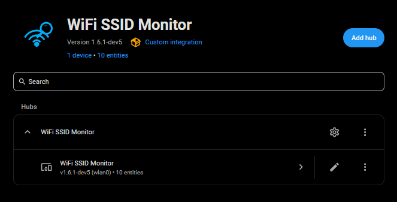
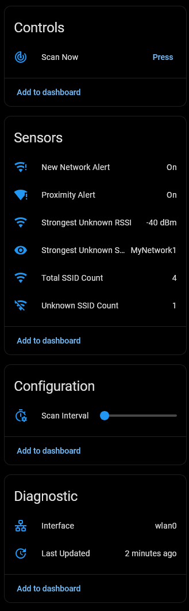
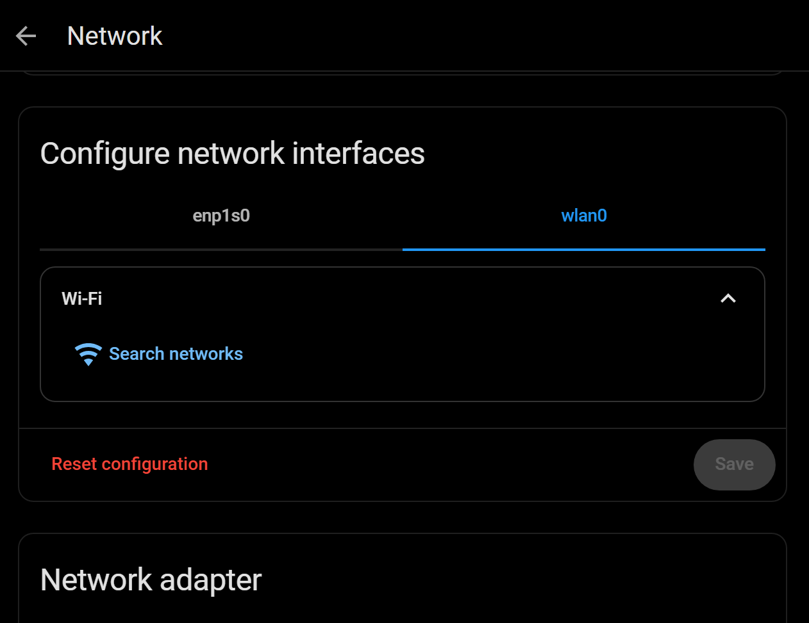

# WiFi SSID Monitor for Home Assistant

   [](https://opensource.org/licenses/Apache-2.0) [](https://github.com/PlayFaster/ha-wifi-ssid-monitor/actions/workflows/validate.yaml) 
  
A Home Assistant integration that monitors and reports on WiFi networks in your environment. Using the Home Assistant Supervisor API, this integration scans for SSIDs, counts detectable networks, and identifies unknown networks based on a configurable allowlist.
  
## ✅ Features

- **Real-time SSID Scanning**: Count all detectable WiFi networks in your vicinity
- **Unknown Network Detection**: Identify networks not in your pre-configured known list
- **Detailed Attributes**: View complete lists of detected and unknown SSIDs
- **Dynamic Polling Control**: Adjust the scan frequency directly from the Home Assistant UI or via automation.
- **Auto-detected Interface**: Interface names (e.g., `wlan0`) are automatically populated during setup where available. This can be entered manually if auto-detection is not successful.

## 📋 System Requirements

**Important:** This integration requires your Home Assistant system to have **WiFi capabilities**.

> [!NOTE] Many Home Assistant installations (particularly supervised or container-based deployments on headless systems) may not have WiFi hardware or drivers available. This integration will not function on systems without WiFi networking support. If you see errors during setup, verify that your system has WiFi enabled under **Settings > System > Network**.

## 🎯 Use Cases

### Security Monitoring: Rogue Network Detection

Monitor for unexpected WiFi networks in your environment that could indicate unauthorized access points or security threats. The integration alerts you when new networks appear that are not on your known networks list.

**Example automation:**

```yaml
alias: "Alert on Rogue WiFi Network"
trigger:
  platform: state
  entity_id: binary_sensor.wifi_ssid_monitor_new_network_alert
  to: "on"
action:
  service: notify.mobile_app_phone
  data:
    message: "Unknown WiFi network detected: {{ states('sensor.wifi_ssid_monitor_unknown_count') }} unknown network(s) found"
```

### Device Management: Smart Device Setup Detection

Identify when smart home devices are broadcasting setup or recovery access points—either when newly installed or after a reset. This helps you track device provisioning status and detect unexpected device resets that may indicate configuration issues.

**Example Use:**

- Detect when a smart device enters pairing mode
- Alert when a previously configured device has reset and needs reconfiguration
- Monitor for expected temporary access points during device setup

**Example automation:**

```yaml
alias: Alert if Device in AP Mode
triggers:
  - entity_id: binary_sensor.wifi_ssid_monitor_new_network_alert
    to: "on"
    trigger: state
conditions:
  - condition: template
    value_template: >
        {{ device_aps | select('in', ssids) | list | length > 0 }}


    alias: Check If Unknown SSID Is Known Smart Device
actions:
  - data:
      message: >-
        Smart Device in AP Mode Detected: {{ states('sensor.wifi_ssid_monitor_unknown_count') }} APs found.


    action: notify.mobile_app_phone
```

### Network Reliability: Known Network Monitoring

Track whether your own WiFi networks remain online. By listing your personal SSIDs in the known networks list and monitoring the network count over time, you can detect when one of your networks has gone offline or become unavailable.

**Example automation:**

```yaml
alias: "Alert if Home WiFi Offline"
trigger:
  platform: numeric_state
  entity_id: sensor.wifi_ssid_monitor_total_count
  below: 2
  for:
    minutes: 5
condition:
  - condition: state
    entity_id: binary_sensor.wifi_ssid_monitor_new_network_alert
    state: "off"
action:
  service: notify.mobile_app_phone
  data:
    message: "WiFi network count has dropped — a home network may be offline"
```

## ✨ Installation

### HACS (Recommended)

1. Add this repository as a **Custom Repository** in HACS:
   - Open HACS in Home Assistant
   - Click **Custom repositories** (⋮ menu)
   - Add repository URL and Type: `Integration`
2. Search for "WiFi SSID Monitor" and click **Download**
3. Restart Home Assistant
4. Go to **Settings > Devices & Services > Add Integration** and search for "WiFi SSID Monitor"

### Manual Installation

1. Download the repository
2. Copy the `custom_components/wifi_ssid_monitor` folder to your Home Assistant `custom_components` directory
3. Restart Home Assistant
4. Go to **Settings > Devices & Services > Add Integration** and search for "WiFi SSID Monitor"

## ⚙️ Configuration

All configuration is handled through the Home Assistant UI. During setup, you will configure:

### Initial Setup

- **WiFi Interface**: The network interface to monitor (e.g., `wlan0`)
  - Detected interfaces will be automatically populated where available
  - If auto-detection fails, you can enter the interface name manually
- **Known SSIDs**: Comma-separated list of WiFi networks to consider "known" (e.g., `Home-WiFi, Guest-Network`)

### Runtime Options

After installation, you can modify settings via the integration's **Configure** (gear icon) options menu:

- **Known SSIDs**: Update the list of known networks
- **Scan Interval**: Adjust polling frequency (1–180 minutes) (default 10 minutes).
  - Note this is also available directly from the UI as a number slider, which can be dynamically changed via automation schedule, etc. (example below).
- **WiFi Interface**: Change which interface is monitored

> [!TIP]
>
> **Finding Your WiFi Interface Name:**
>
> 1. In Home Assistant, go to **Settings > System > Network**
> 2. Check **Configure network interfaces**
> 3. Your WiFi interface will typically be listed as `wlan0`, `wlan1`, `wlp2s0`, or similar
> 4. During setup, the integration will attempt to auto-detect available WiFi interfaces

## 📊 Entities

### Sensors

| Entity | Type | Description |
| --- | --- | --- |
| `sensor.wifi_ssid_monitor_total_count` | Measurement | Total number of detected WiFi networks |
| `sensor.wifi_ssid_monitor_unknown_count` | Measurement | Count of networks not in your known list |
| `sensor.wifi_ssid_monitor_interface` | Diagnostic | Name of the monitored WiFi interface |

**Attributes:** The total and unknown count sensors include SSID attributes:

- `ssids`: List of all detected (`total`) or unknown (`unknown`) network names

### Binary Sensors

| Entity | Description |
| --- | --- |
| `binary_sensor.wifi_ssid_monitor_new_network_alert` | On when unknown networks are detected; Off when all detected networks are known |

### Number Entities

| Entity                                   | Description                               |
| ---------------------------------------- | ----------------------------------------- |
| `number.wifi_ssid_monitor_scan_interval` | Adjustable scan frequency (1–180 minutes) |

**Example automation:**

```yaml
alias: "WIFI: Set Scan Interval Based on Time"
description: "Adjusts SSID scan interval for day and evening cycles"
mode: single
trigger:
  - platform: time
    at: "08:00:00"
    id: "day"
  - platform: time
    at: "18:00:00"
    id: "evening"
action:
  - choose:
      - conditions:
          - condition: trigger
            id: "day"
        sequence:
          - service: number.set_value
            target:
              entity_id: number.wifi_ssid_monitor_scan_interval
            data:
              value: 10
      - conditions:
          - condition: trigger
            id: "evening"
        sequence:
          - service: number.set_value
            target:
              entity_id: number.wifi_ssid_monitor_scan_interval
            data:
              value: 20
```

## 📸 Screenshots

### Integration Overview



### Sensor Display



### Network Interface Configuration



## 🔧 Troubleshooting

### Integration Fails to Load

**Issue:** "Failed to connect to Supervisor API" or similar errors

**Causes & Solutions:**

- **WiFi hardware unavailable:** Verify your Home Assistant system has WiFi capabilities (see System Requirements above)
- **Invalid interface:** Ensure the interface name is correct (e.g., `wlan0` not `wlan`)

### No Networks Detected

- Verify the interface name is correct for your system
- Ensure WiFi is enabled in **Settings > System > Network**
- Check that networks are broadcasting in your vicinity
- Review the Home Assistant logs for detailed error messages

## 📝 Maintenance Status

This is a **personal project**. Support and updates are provided on a **"best-effort"** basis only. While I use this integration daily and aim to keep it functional with the latest Home Assistant releases, I cannot guarantee immediate fixes for issues or compatibility with all releases.

## 🤝 Contributors & Acknowledgements

- This project was developed with the assistance of AI to ensure code quality and adherence to best practices.

## 📄 License [](https://opensource.org/licenses/Apache-2.0)

This project uses the Apache License, Version 2.0, for more details see the [license](LICENSE) document.

---

**For issues, feature requests, or contributions, please visit the [GitHub repository](https://github.com/PlayFaster/ha-wifi-ssid-monitor).**
