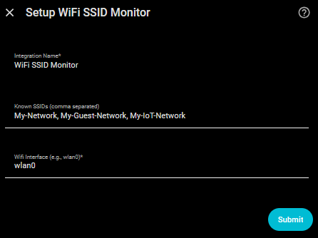

# WiFi SSID Monitor for Home Assistant

[](https://hacs.xyz/) [](https://hacs.xyz/docs/faq/custom_repositories) [](https://github.com/PlayFaster/ha-wifi-ssid-monitor/releases) [](https://opensource.org/licenses/Apache-2.0) [](https://github.com/PlayFaster/ha-wifi-ssid-monitor/actions/workflows/validate.yaml)  [](https://github.com/PlayFaster/ha-wifi-ssid-monitor/commits/main)

A Home Assistant integration that monitors and reports on WiFi networks in your environment using the Home Assistant Supervisor API.

> [!NOTE]
>
> **Is this the right integration for you?**
>
> - **If you want to monitor WiFi networks** in your vicinity, track connection uptime, or detect rogue/unauthorized access points, then **yes**.
> - **This integration is for you if** you want:
>   - **Rogue AP Detection** — Count detectable networks and alert on unknown SSIDs.
>   - **Smart Device Setup Tracking** — Identify when new devices enter pairing/AP mode.
>   - **Dynamic Polling** — Change scan intervals directly from the Home Assistant UI or via automations.
>
> Requires a Home Assistant Supervised or HAOS installation with physical WiFi hardware. The Supervisor API is not available on container or core installations.

## 📋 Table of Contents

- [WiFi SSID Monitor for Home Assistant](#wifi-ssid-monitor-for-home-assistant)
  - [📋 Table of Contents](#-table-of-contents)
  - [🔧 Compatibility \& Requirements](#-compatibility--requirements)
  - [🎯 Use Cases](#-use-cases)
  - [✅ Features](#-features)
  - [🔍 What You Get](#-what-you-get)
  - [💡 Example Automations](#-example-automations)
  - [📸 Screenshots](#-screenshots)
  - [📥 Installation](#-installation)
  - [🔧 Configuration](#-configuration)
  - [🔨 Under the Hood — Technical Architecture](#-under-the-hood--technical-architecture)
  - [❓ FAQ \& Troubleshooting](#-faq--troubleshooting)
  - [❌ Removal](#-removal)
  - [❗ Known Limitations /❔ What's Missing?](#-known-limitations--whats-missing)
  - [📝 Maintenance Status](#-maintenance-status)
  - [🤝 Contributors \& Acknowledgements](#-contributors--acknowledgements)
  - [📄 License](#-license)

## 🔧 Compatibility & Requirements

**💻 Tested Hardware:**

- **Fully Tested**: Home Assistant OS (HAOS) on **Raspberry Pi 4** and **Intel (standard x86) Mini PC** with compatible WiFi hardware.

**🌐 Network & System:**

- Local network access and a **Home Assistant OS (HAOS)** or **Supervised** installation is required to access the Supervisor Network API.
- WiFi must be enabled under **Settings > System > Network**.

**🏠 Home Assistant Version:**

- Minimum: Home Assistant **2024.1.0**
- Minimum Python: **3.12+**

## 🎯 Use Cases

- **Security Monitoring (Rogue Network Detection)**: Monitor for unexpected WiFi networks in your environment that could indicate unauthorized access points or security threats. Get alerted instantly when unrecognized SSIDs are broadcast in range.
- **Device Management (Smart Device Setup Detection)**: Identify when smart home devices enter pairing or recovery mode (broadcasting their own setup APs) due to a fresh installation or an unexpected reset.
- **Network Uptime (Known Network Monitoring)**: Track whether your own home networks remain online. Get notified if one of your personal access points stops broadcasting or goes offline.
- **Dynamic Performance Tuning**: Automatically lower the scan frequency during high-traffic or evening hours and speed it up during security cycles to minimize system load.

## ✅ Features

- **Real-time SSID Scanning**: Count all detectable WiFi networks in range and view full SSID lists with signal strength and frequency band in sensor attributes.
- **Unknown Network Detection**: Identify networks not in your known list, with wildcard pattern matching (e.g., `Guest_*`) for flexible filtering.
- **Proximity Alert**: A binary sensor fires when an unknown network's signal strength exceeds a configurable threshold, indicating a nearby rogue AP.
- **On-Demand Scan**: Trigger an immediate scan at any time using the **Scan Now** button entity or the `wifi_ssid_monitor.scan_now` service — no need to wait for the next interval.
- **Service API**: Five callable services cover the full management lifecycle — add, remove, or replace the known list, trigger on-demand scans, and clear history.
- **Last Seen Tracking**: Each unknown SSID records when it was last detected, first detected, and how many times it has appeared — all persisted across Home Assistant restarts with a configurable TTL.
- **Dynamic Polling Control**: Adjust the scan frequency (1–180 minutes) from the HA UI or via automations.
- **Band Filter**: Restrict scanning to 2.4 GHz only, 5 GHz only, or all bands to reduce noise from neighboring networks.
- **SSID Denylist**: Mark specific SSID patterns as permanently unknown — useful for neighbor networks that should never be whitelisted.
- **Hidden Network Control**: Toggle whether unbroadcasted (hidden) SSIDs are counted or silently ignored.
- **Auto-detected Interface**: WiFi interfaces (e.g., `wlan0`) are automatically populated during setup where available.

## 🔍 What You Get

This integration provides **10 entities** (all enabled by default) organized under a single WiFi SSID Monitor device.

### Sensors

| Entity | Type | Description |
| --- | --- | --- |
| `sensor.wifi_ssid_monitor_total_ssid_count` | Measurement | Total number of detected WiFi networks |
| `sensor.wifi_ssid_monitor_unknown_ssid_count` | Measurement | Count of networks not in your known list |
| `sensor.wifi_ssid_monitor_last_updated` | Diagnostic | Timestamp of the last successful WiFi scan |
| `sensor.wifi_ssid_monitor_interface` | Diagnostic | Name of the monitored WiFi interface |
| `sensor.wifi_ssid_monitor_strongest_unknown_ssid` | Diagnostic | SSID name of the closest unknown network (highest signal strength); `unavailable` when no unknown networks are visible |
| `sensor.wifi_ssid_monitor_strongest_unknown_rssi` | Measurement | Signal strength of the closest unknown network (dBm); `unavailable` when no unknown networks are visible |

**Attributes:** The count sensors expose per-SSID data in their state attributes; see the "On Sensor" column for which attributes apply to each:

| Attribute | On Sensor | Description |
| :-- | :-- | :-- |
| `ssids` | Both | List of detected (`total`) or unknown (`unknown`) SSID names |
| `signal_strengths` | Both | `{ssid: dBm}` — signal strength per network where data is available |
| `bands` | Both | `{ssid: "2.4 GHz" / "5 GHz"}` — frequency band where channel data is available |
| `last_seen` | Unknown only | `{ssid: ISO-timestamp}` — when each unknown SSID was last detected (persistent; pruned after configured TTL) |
| `first_seen` | Unknown only | `{ssid: ISO-timestamp}` — when each unknown SSID was first detected (persistent) |
| `visit_counts` | Unknown only | `{ssid: int}` — scan cycles in which each unknown SSID has appeared (persistent) |

### Binary Sensors

| Entity | Description |
| --- | --- |
| `binary_sensor.wifi_ssid_monitor_new_network_alert` | On when unknown networks are detected; Off when all detected networks are known |
| `binary_sensor.wifi_ssid_monitor_proximity_alert` | On when an unknown network's signal meets or exceeds the configured RSSI threshold |

The `proximity_alert` sensor exposes `strongest_unknown_rssi` (dBm of the closest unknown network — also available as a dedicated sensor entity for dashboards and long-term statistics) and `threshold` (the configured limit) as state attributes.

### Number Entities

| Entity                                   | Description                               |
| ---------------------------------------- | ----------------------------------------- |
| `number.wifi_ssid_monitor_scan_interval` | Adjustable scan frequency (1–180 minutes) |

### Button Entities

| Entity | Description |
| --- | --- |
| `button.wifi_ssid_monitor_scan_now` | Triggers an immediate on-demand WiFi scan, regardless of the current scheduled interval |

### Services

All services accept an optional `config_entry_id` to target a specific integration entry. Leave it blank to apply to all configured entries.

| Service | Description |
| :-- | :-- |
| `wifi_ssid_monitor.add_known_ssid` | Adds an SSID to the known list; triggers an immediate re-scan |
| `wifi_ssid_monitor.remove_known_ssid` | Removes an SSID or pattern from the known list; triggers a re-scan if the list changes |
| `wifi_ssid_monitor.scan_now` | Triggers an immediate WiFi scan |
| `wifi_ssid_monitor.clear_last_seen` | Clears all `last_seen`, `first_seen`, and `visit_counts` history |
| `wifi_ssid_monitor.set_known_ssids` | Replaces the entire known list; returns the previous list as response data |

#### `add_known_ssid`

| Parameter         | Required | Description                                  |
| :---------------- | :------- | :------------------------------------------- |
| `ssid`            | **Yes**  | SSID to add to the known list                |
| `config_entry_id` | No       | Target a specific entry; blank = all entries |

```yaml
action: wifi_ssid_monitor.add_known_ssid
data:
  ssid: "MyHomeNetwork"
  # config_entry_id: "abc123"  # Optional
```

#### `remove_known_ssid`

| Parameter | Required | Description |
| :-- | :-- | :-- |
| `ssid` | **Yes** | Exact SSID or pattern to remove — must match a list entry exactly; wildcards are not expanded |
| `config_entry_id` | No | Target a specific entry; blank = all entries |

```yaml
action: wifi_ssid_monitor.remove_known_ssid
data:
  ssid: "MyHomeNetwork"
```

#### `scan_now`

| Parameter         | Required | Description                                  |
| :---------------- | :------- | :------------------------------------------- |
| `config_entry_id` | No       | Target a specific entry; blank = all entries |

```yaml
action: wifi_ssid_monitor.scan_now
```

#### `clear_last_seen`

Clears all three history stores (`last_seen`, `first_seen`, `visit_counts`). The next scan repopulates history from that point forward.

| Parameter         | Required | Description                                  |
| :---------------- | :------- | :------------------------------------------- |
| `config_entry_id` | No       | Target a specific entry; blank = all entries |

```yaml
action: wifi_ssid_monitor.clear_last_seen
```

#### `set_known_ssids`

Replaces the entire known networks list in a single call. Returns the previous list for each affected entry as service response data. Useful for syncing an external source of truth into the integration.

| Parameter | Required | Description |
| :-- | :-- | :-- |
| `known_ssids` | **Yes** | Comma-separated SSIDs and patterns — replaces the existing list entirely |
| `config_entry_id` | No | Target a specific entry; blank = all entries |

```yaml
action: wifi_ssid_monitor.set_known_ssids
response_variable: result
data:
  known_ssids: "Home-WiFi, Guest_*"
```

Response (`result`):

```yaml
entries:
  abc123def456: "OldNetwork1, OldNetwork2"
```

### 📊 Long Term Statistics (LTS)

Home Assistant stores Long Term Statistics for numeric sensors that have a `state_class` set. This integration enables LTS for sensors where tracking trend data is useful:

| Sensors with LTS enabled | Why |
| :-- | :-- |
| `sensor.wifi_ssid_monitor_total_ssid_count` | Track WiFi network density trends over time |
| `sensor.wifi_ssid_monitor_unknown_ssid_count` | Monitor for unrecognized network spikes in your environment |
| `sensor.wifi_ssid_monitor_strongest_unknown_rssi` | Monitor signal strength trends of nearby unknown networks |

The remaining sensors (text, timestamp, non-measurement) do not get added to LTS based on Home Assistant desgin.

## 💡 Example Automations

### 🚨 Rogue Network Detection Alert

This automation fires when an unknown network is detected and sends a notification to your mobile phone.

```yaml
alias: "Alert on Rogue WiFi Network"
triggers:
  - trigger: state
    entity_id: binary_sensor.wifi_ssid_monitor_new_network_alert
    to: "on"
actions:
  action: notify.mobile_app_phone
  data:
    message: |
      Unknown WiFi network detected: {{ states('sensor.wifi_ssid_monitor_unknown_ssid_count') }} unknown network(s) found
```

### 📟 Smart Device Setup Detection

Detect when a smart home device enters access point (pairing) mode.

```yaml
alias: Alert if Device in AP Mode
triggers:
  - trigger: state
    entity_id: binary_sensor.wifi_ssid_monitor_new_network_alert
    to: "on"
conditions:
  - condition: template
    alias: Check If Unknown SSID Is a Known Smart Device
    value_template: |
      
      
      {{ device_aps | select('in', ssids) | list | length > 0 }}
actions:
  - action: notify.mobile_app_phone
    data:
      message: |
        Smart Device in AP Mode Detected: {{ states('sensor.wifi_ssid_monitor_unknown_ssid_count') }} APs found.
```

### 🌐 Home WiFi Offline Alert

Monitor whether one of your own networks has stopped broadcasting.

```yaml
alias: "Alert if Home WiFi Offline"
triggers:
  - trigger: numeric_state
    entity_id: sensor.wifi_ssid_monitor_total_ssid_count
    below: 2
    for:
      minutes: 5
conditions:
  - condition: state
    entity_id: binary_sensor.wifi_ssid_monitor_new_network_alert
    state: "off"
actions:
  - action: notify.mobile_app_phone
    data:
      message: "WiFi network count has dropped — a home network may be offline"
```

### 🔁 Dynamic Polling Control

Automatically adjust the scan frequency between day and evening hours.

```yaml
alias: "WiFi: Set Scan Interval Based on Time"
description: "Adjusts SSID scan interval for day and evening cycles"
mode: single
triggers:
  - trigger: time
    at: "08:00:00"
    id: "day"
  - trigger: time
    at: "18:00:00"
    id: "evening"
actions:
  - choose:
      - conditions:
          - condition: trigger
            id: "day"
        sequence:
          - action: number.set_value
            target:
              entity_id: number.wifi_ssid_monitor_scan_interval
            data:
              value: 10
      - conditions:
          - condition: trigger
            id: "evening"
        sequence:
          - action: number.set_value
            target:
              entity_id: number.wifi_ssid_monitor_scan_interval
            data:
              value: 20
```

### 📡 Proximity Alert Notification

Alert when an unknown network is detected unusually close to the premises.

```yaml
alias: "Alert on Nearby Unknown WiFi"
description: "Fires when an unknown network signal exceeds the proximity threshold"
triggers:
  - trigger: state
    entity_id: binary_sensor.wifi_ssid_monitor_proximity_alert
    to: "on"
actions:
  - action: notify.mobile_app_phone
    data:
      message: |
        Unknown WiFi detected nearby! Signal: {{ state_attr('binary_sensor.wifi_ssid_monitor_proximity_alert', 'strongest_unknown_rssi') }} dBm. Networks: {{ state_attr('sensor.wifi_ssid_monitor_unknown_ssid_count', 'ssids') | join(', ') }}
```

### 🔍 Security Scan on Arrival

Trigger an immediate scan the moment someone arrives home, rather than waiting for the next scheduled poll.

```yaml
alias: "WiFi: Scan on Arrival"
description: "Runs an on-demand WiFi scan when someone arrives home"
triggers:
  - trigger: state
    entity_id: person.your_name
    to: "home"
actions:
  - action: button.press
    target:
      entity_id: button.wifi_ssid_monitor_scan_now
```

### 🔀 Dynamic Guest Network Whitelisting

Automatically whitelist a guest network when a guest WiFi switch is turned on, and remove it from the known list when the guest WiFi is turned off.

```yaml
alias: "WiFi: Manage Guest Network Whitelist"
description: "Dynamically updates known networks when Guest WiFi status changes"
mode: single
triggers:
  - trigger: state
    entity_id: switch.router_guest_wifi
actions:
  - choose:
      - conditions:
          - condition: state
            entity_id: switch.router_guest_wifi
            state: "on"
        sequence:
          - action: wifi_ssid_monitor.add_known_ssid
            data:
              ssid: "MyGuestWiFi_*"
      - conditions:
          - condition: state
            entity_id: switch.router_guest_wifi
            state: "off"
        sequence:
          - action: wifi_ssid_monitor.remove_known_ssid
            data:
              ssid: "MyGuestWiFi_*"
```

### 🧹 Weekly History Cleanup

Prune the persistent scan history database once a week to prevent the list of temporary, one-off unknown SSIDs from growing too large.

```yaml
alias: "WiFi: Weekly History Reset"
description: "Clears persistent last-seen, first-seen, and visit-count history weekly"
triggers:
  - trigger: time
    at: "00:00:00"
conditions:
  - condition: time
    weekday:
      - sun
actions:
  - action: wifi_ssid_monitor.clear_last_seen
```

## 📸 Screenshots

| Integration Overview | Sensor Entities |
| :-: | :-: |
|  |  |

| Setup | Network Interface Configuration |
| :-: | :-: |
|  |  |

## 📥 Installation

### ✨ HACS (Recommended)

1. Add this repository as a **Custom Repository** in HACS:
   - Open HACS in Home Assistant
   - Click **Custom repositories** (⋮ menu)
   - Add repository URL and Type: `Integration`
2. Search for "WiFi SSID Monitor" and click **Download**
3. Restart Home Assistant
4. Go to **Settings > Devices & Services > Add Integration** and search for "WiFi SSID Monitor"

### 💾 Manual Installation

1. Download the repository
2. Copy the `custom_components/wifi_ssid_monitor` folder to your Home Assistant `custom_components` directory
3. Restart Home Assistant
4. Go to **Settings > Devices & Services > Add Integration** and search for "WiFi SSID Monitor"

## 🔧 Configuration

### 🔧 Initial Setup

Setup is handled entirely via the UI under **Settings > Devices & Services > Add Integration**.

| Parameter | Required | Description |
| :-- | :-- | :-- |
| **WiFi Interface** | **Yes** | The network interface to monitor (e.g., `wlan0`). Autopopulated where available. |
| **Known SSIDs** | No | Comma-separated list of WiFi networks to treat as known (e.g., `Home-WiFi, Guest-Network`). |
| **Integration Name** | No | Display name shown in the UI for this integration instance (default: `WiFi SSID Monitor`). |

### 🔩 Runtime Options

After setup, settings can be updated by clicking **Configure** on the integration card:

| Parameter | Default | Range | Description |
| :-- | :-- | :-- | :-- |
| **Known SSIDs** | — | String | Comma-separated list of known networks. Wildcards supported (e.g., `Guest_*`). Case-sensitive. |
| **Always-Unknown SSIDs** | — | String | Comma-separated fnmatch patterns permanently treated as unknown, even if they also match an entry in the known list. Useful for flagging neighbor networks that should never be whitelisted. |
| **Scan Interval** | `600` | 60–10800s | Polling frequency (in seconds; equivalent to 1–180 minutes). |
| **Band Filter** | `all` | `all` / `2.4` / `5` | Restrict scanning to a specific frequency band. Networks on other bands are excluded from all counts and attributes. |
| **WiFi Interface** | `wlan0` | String | Change which WiFi interface is monitored. |
| **Include Hidden Networks** | On | Toggle | When off, networks without a broadcasted SSID are ignored entirely and do not appear in any count or attribute. |
| **Proximity Alert Threshold** | `-60` | −100 to −30 dBm | Signal strength at which the Proximity Alert sensor fires. **dBm values are negative** — −40 dBm means the device must be very close; −80 dBm allows distant signals to trigger the alert. |
| **Last Seen History TTL** | `90` | 0–366 days | Number of days to retain `last_seen`, `first_seen`, and `visit_counts` history entries. Set to `0` to keep all history indefinitely. |

> [!TIP]
>
> **Finding Your WiFi Interface Name:**
>
> 1. In Home Assistant, go to **Settings > System > Network**.
> 2. Check **Configure network interfaces**.
> 3. Your WiFi interface will typically be listed as `wlan0`, `wlan1`, `wlp2s0`, or similar.

### ⚙️ Explaining the Configuration Options

#### 1. Wildcard SSID Matching (Known & Always-Unknown)

SSID matching supports standard shell wildcards (`fnmatch` patterns):

- `*` — Matches anything, including an empty string (e.g., `Guest_*` matches `Guest_Home` and `Guest_`).
- `?` — Matches any single character (e.g., `IoT_?` matches `IoT_1` but not `IoT_12`).
- `[seq]` — Matches any character in the sequence (e.g., `Home_[12]` matches `Home_1` and `Home_2`).

#### 2. Proximity Alert Threshold & Distance Mapping

RSSI (Received Signal Strength Indicator) values are measured in negative decibels (dBm). Since the values are negative, numbers closer to zero represent stronger signals:

- **−30 to −50 dBm** (Very Strong) — The broadcasting device is extremely close, likely in the same room or immediate vicinity.
- **−50 to −70 dBm** (Strong/Medium) — The broadcasting device is nearby, typically within the home or property boundary (default threshold: −60 dBm).
- **−70 to −85 dBm** (Weak) — The broadcasting device is moderately distant, such as a neighbor's network or a device out on the street.
- **−85 to −100 dBm** (Very Weak) — The broadcasting device is at the edge of detection.

#### 3. Last Seen History TTL

The integration keeps track of how often and when unknown networks are seen:

- `first_seen` — Timestamp of the very first scan cycle the SSID was detected.
- `last_seen` — Timestamp of the most recent scan cycle the SSID was detected.
- `visit_counts` — Total number of scan cycles in which the SSID has appeared. To prevent storage bloat, any SSID that has not been seen for longer than the TTL window is pruned automatically from history on the next scan. Setting this to `0` disables pruning.

## 🔨 Under the Hood — Technical Architecture

### 🔄 Polling & 3-Strike Resilience 🩹

The integration utilizes a custom polling mechanism designed to interact with the Home Assistant Supervisor Network API:

- **Supervisor Endpoint**: Polls the endpoint `/network/interface/{interface}/accesspoints` to gather access point configurations.
- **3-Strike Logic**: To prevent entities flickering to `Unavailable` due to temporary network congestion or Supervisor latency, the integration holds its last known values for up to 3 consecutive failures. If the 4th consecutive poll fails, the entities are marked `Unavailable` and an issue is raised in the Home Assistant repairs center.
- **Immediate Refresh**: Updating the **Known SSIDs** list via the configuration options menu triggers an immediate background scan, bypassing the scheduled timer. You can also trigger an immediate scan at any time by pressing the **Scan Now** button entity or by calling the `wifi_ssid_monitor.scan_now` service. (Changing the scan interval only updates the timer — it does not trigger an immediate scan.)

### 🆔 Stable Entities & Reconfiguration

- **Interface-Based Identity**: The integration registers its unique ID based on `wifi_ssid_monitor_{interface}`. This prevents duplicate configurations for the same interface and ensures entity history remains stable.
- **Data Validation**: Values retrieved from the Supervisor API are run through guard validations. Out-of-bounds metrics (e.g., total count exceeding 256) are filtered to prevent database corruption.

### 💾 Persistent History

The integration persists three history stores across Home Assistant restarts using `homeassistant.helpers.storage`:

- **`last_seen`**: ISO timestamp of the most recent scan cycle in which each unknown SSID was detected.
- **`first_seen`**: ISO timestamp of the scan cycle in which each unknown SSID was first detected.
- **`visit_counts`**: Count of scan cycles in which each unknown SSID has appeared.

Entries older than the **Last Seen History TTL** (default: 90 days) are pruned automatically on the next scan. Set TTL to `0` to retain all entries indefinitely. Call `wifi_ssid_monitor.clear_last_seen` to reset all three stores immediately.

## ❓ FAQ & Troubleshooting

### Integration Fails to Load

**Issue:** "Failed to connect to Supervisor API" or similar errors.

**Causes & Solutions:**

- **WiFi hardware unavailable**: Verify your Home Assistant system has physical WiFi capabilities enabled under **Settings > System > Network**.
- **Invalid interface**: Ensure the interface name is correct and configured on your host OS.

### No Networks Detected

- Verify the interface name is correct for your system.
- Ensure WiFi is enabled in **Settings > System > Network**.
- Check that networks are actively broadcasting in range of the system.
- Review the Home Assistant logs for detailed error messages.

### Proximity Alert Is Always On

**Issue:** `binary_sensor.wifi_ssid_monitor_proximity_alert` stays on permanently even when no suspicious device is nearby.

**Causes & Solutions:**

- **Threshold is too permissive**: The default threshold of −60 dBm may be too broad for a dense WiFi environment (many neighbors' networks). Open **Configure** on the integration card and raise the **Proximity Alert Threshold** toward −50 or −40 dBm to require a closer signal before the alert fires.
- **Persistent unknown networks in range**: Check the `signal_strengths` attribute on `sensor.wifi_ssid_monitor_unknown_ssid_count` to identify which network is triggering the alert, then decide whether to add it to the Known SSIDs list.

### Known SSID Pattern Not Matching

**Issue:** A network remains flagged as unknown even though a matching entry or wildcard is in the Known SSIDs list.

**Causes & Solutions:**

- **Case mismatch**: Pattern matching is case-sensitive. Verify the pattern casing exactly matches the SSID (e.g., `Guest_*` will not match `guest_wifi`).
- **Missing wildcard**: A plain string is treated as an exact match. Use `Guest_*` or `*guest*` for partial matches.
- **Trailing spaces**: The Known SSIDs field strips leading/trailing whitespace from each entry, but double-check there are no invisible characters.

### `last_seen` History Contains Stale or Unexpected Entries

**Issue:** The `last_seen`, `first_seen`, or `visit_counts` attributes on `sensor.wifi_ssid_monitor_unknown_ssid_count` contain entries for SSIDs that have not been seen recently, or history is larger than expected.

**Cause & Solutions:**

- **Automatic TTL pruning**: The integration automatically removes entries older than the **Last Seen History TTL** setting (default: 90 days). Entries for SSIDs not seen within that window are pruned on the next scan. To change the retention window, open **Configure** on the integration card and adjust the **Last Seen History TTL** value. Set it to `0` to keep all entries indefinitely.
- **Manual reset**: To immediately clear all `last_seen`, `first_seen`, and `visit_counts` history, call the `wifi_ssid_monitor.clear_last_seen` service from **Developer Tools > Services**. This resets all three history stores for the targeted entry (or all entries if `config_entry_id` is omitted).

## ❌ Removal

To remove the integration from Home Assistant:

1. Go to **Settings > Devices & Services**.
2. Find the **WiFi SSID Monitor** card and click into it.
3. Click the **three dots** (⋮) next to the gear icon and select **Delete**.
4. Confirm deletion.

To fully uninstall (HACS):

1. Go to **HACS > Integrations**.
2. Find the **WiFi SSID Monitor** and click into it.
3. Click the **three dots** (⋮) at the top right and select **Remove**.
4. Restart Home Assistant.

## ❗ Known Limitations /❔ What's Missing?

- **Hidden Networks (No Broadcasted SSID)**: WiFi access points that do not broadcast an SSID are grouped together as a single `[hidden]` entry in the network count and SSID lists. If multiple hidden networks are present in your area, the total count will reflect only one `[hidden]` entry regardless of how many physical hidden APs are detected. This is a limitation of the current implementation — hidden networks cannot be individually identified without SSID data. You can disable hidden network tracking entirely via the **Include Hidden Networks** option.
- **Strongest Unknown Sensors Unavailable Between Scans**: `sensor.wifi_ssid_monitor_strongest_unknown_ssid` and `sensor.wifi_ssid_monitor_strongest_unknown_rssi` return `unavailable` when no unknown networks are currently visible. They only hold a value immediately after a scan that detected at least one unknown SSID.
- **Pattern Matching is Case-Sensitive**: Known SSID patterns (including wildcards like `Guest_*`) are matched case-sensitively. `homewifi` and `HomeWiFi` are treated as different networks — make sure your patterns match the exact casing of the SSIDs you want to filter.
- **Proximity Alert Threshold Direction**: The threshold is a dBm value, which is always negative. A less-negative value (e.g., −40 dBm) requires the unknown device to be very close before the alert fires. A more-negative value (e.g., −80 dBm) lets distant signals trigger it. If the alert fires constantly in a dense urban area, raise the threshold closer to −40.

## 📝 Maintenance Status

This is a **personal project**. Support and updates are provided on a **"best-effort"** basis only. While I use this integration daily and aim to keep it functional with the latest Home Assistant releases, I cannot guarantee immediate fixes for issues or compatibility with all releases.

## 🤝 Contributors & Acknowledgements

- This project was developed with the assistance of AI to ensure code quality and adherence to best practices.

## 📄 License

[](https://opensource.org/licenses/Apache-2.0)

This project is licensed under the Apache License, Version 2.0. See [LICENSE](LICENSE) for details.

---

💬 **Questions or Issues?** Visit the [GitHub repository](https://github.com/PlayFaster/ha-wifi-ssid-monitor).
