<!-- markdownlint-disable MD033 -->

# WiFi SSID Monitor for Home Assistant

[](https://hacs.xyz/) [](https://hacs.xyz/docs/faq/custom_repositories) [](https://github.com/PlayFaster/ha-wifi-ssid-monitor/releases) [](https://opensource.org/licenses/Apache-2.0) [](https://github.com/PlayFaster/ha-wifi-ssid-monitor/actions/workflows/validate.yaml)  [](https://github.com/PlayFaster/ha-wifi-ssid-monitor/commits/main)

---


---

A Home Assistant integration that monitors and reports on WiFi networks in your environment using the Home Assistant Supervisor Network API.

- **WiFi Environment Awareness**: Regularly scans for visible WiFi SSIDs, signal quality (0–100%), frequency bands, and access point (AP) modes.
- **Rogue SSID & Security Alerting**: Distinguishes known networks from unexpected arrivals, firing immediate **New Network** events and a **Proximity Alert** when an unknown AP gets too close.
- **Smart Device Setup Tracking**: Can detect when smart home devices enter access-point/pairing mode due to fresh installation or unexpected factory resets.
- **Dynamic Polling & Low Noise**: Fully automatable scan interval, band filtering switches, hidden network controls, and database recorder exclusions.

> [!NOTE]
>
> **Is this the right integration for you?**
>
> - **If you want to monitor WiFi networks in your vicinity**, track connection uptime, or detect rogue/unauthorized access points, then **yes**.
> - **This integration is for you if** you want:
>   - **Rogue AP Detection** - Count detectable networks and alert on unknown SSIDs.
>   - **Smart Device Setup Tracking** - Identify when new devices enter pairing/AP mode.
>   - **Dynamic Polling** - Change scan intervals directly from the Home Assistant UI or via automations.
>
> Requires a Home Assistant Supervised or HAOS installation with physical WiFi hardware. The Supervisor API is not available on plain container or core only installations.
>
> If you run a Ubiquiti UniFi Network on a UDM Gateway with UniFI Access Points you may be interested in my [UniFi Network Monitor](https://github.com/PlayFaster/ha-unifi-network-monitor) which provides similar capability (Rogue Access Point monitoring) but across all of your UniFi Access Points.

---

## 💥 Breaking Changes

### 🛑 Upgrading from 1.6.x to 2.0.0 or Above - Breaking Changes

- The Version 2.0.0 release corrects long-standing signal-unit and band-filter bugs, which required renaming several things.
- There are also some moves. This was not done lightly, but the previous set-up was incorrect.

<details>

<summary>
&nbsp; &nbsp; ➕ &nbsp; &nbsp; Click to Expand for Details:
</summary><br>

> 1. **`sensor.wifi_ssid_monitor_strongest_unknown_rssi` is removed**, replaced by `sensor.wifi_ssid_monitor_strongest_unknown_signal` (0–100%, not dBm). The old entity becomes unavailable - delete it when convenient; its long-term statistics are kept (delete in Tools > Statistics). Update any dashboard or automation referencing it.
> 2. **Signal is now a 0–100% quality figure** everywhere. Higher means closer. The Proximity Alert now compares on this scale, and its threshold moved to the **Proximity Signal Threshold** number entity (default 80%). A stored dBm threshold is migrated automatically.
> 3. **The list-management services were renamed and merged.** `add_known_ssid` → `add_ssid`, `remove_known_ssid` → `remove_ssid`, `set_known_ssids` → `set_ssids`, each now taking a required `target: known | denylist` (and `set_known_ssids`'s `known_ssids` field is now `values`). **There are no aliases** - automations calling the old names will fail. Update them, including any copied from the guest-network example below.
> 4. **Four settings moved out of the Configure dialog** and are now entities on the device page: **Scan Interval**, **Include Hidden Networks**, and the band filter (now three **Show 2.4/5/6 GHz** switches). The old `scan_bands` option is migrated.

---

</details>

<br>

✅ If you are installing **new** or already on v2.x or above, there are no issues.

## 📋 Table of Contents

- [WiFi SSID Monitor for Home Assistant](#wifi-ssid-monitor-for-home-assistant)
  - [💥 Breaking Changes](#-breaking-changes)
  - [📋 Table of Contents](#-table-of-contents)
  - [🔧 Compatibility \& Requirements](#-compatibility--requirements)
  - [🎯 Use Cases](#-use-cases)
  - [✅ Features](#-features)
  - [🔍 What You Get](#-what-you-get)
  - [📡 Unknown Network Detection](#-unknown-network-detection)
  - [🔘 Controls \& Settings](#-controls--settings)
  - [🧹 Actions (Services)](#-actions-services)
  - [💡 Example Automations](#-example-automations)
  - [📥 Installation](#-installation)
  - [🔧 Configuration](#-configuration)
  - [🔩 Under the Hood - Technical Architecture](#-under-the-hood---technical-architecture)
  - [❓ FAQ \& Troubleshooting](#-faq--troubleshooting)
  - [❗ Known Limitations /❔ What's Missing?](#-known-limitations--whats-missing)
  - [❌ Removal](#-removal)
  - [📝 Maintenance Status](#-maintenance-status)
  - [🤝 Contributors \& Acknowledgements](#-contributors--acknowledgements)
  - [📄 License](#-license)

## 🔧 Compatibility & Requirements

**💻 Tested Hardware:**

- **Fully Tested**: Home Assistant OS (HAOS) on **Raspberry Pi 4** and **Intel (standard x86) Mini PC** with compatible physical WiFi hardware.

**🌐 Network & System:**

- Local network access and a **Home Assistant OS (HAOS)** or **Supervised** installation is required to access the Supervisor Network API.
- WiFi must be enabled under **Settings > System > Network**.

**🏠 Home Assistant Version:**

- Minimum: Home Assistant **2024.8.0**
- Minimum Python: **3.12+** (this is built into and handled by HA, but relevant for non-standard installs).

## 🎯 Use Cases

- **Security & Rogue AP Detection**: Monitor for unexpected WiFi networks in your environment that could indicate unauthorized access points or security threats.
  - **Rogue Network Detection**: Get alerted when unrecognized SSIDs are broadcast in range. → [Rogue Network Detection Alert](#-rogue-network-detection-alert) example.
  - **Proximity Alerting**: Get notified when an unknown network is detected unusually close by signal strength. → [Proximity Alert Notification](#-proximity-alert-notification) example.
  - **New Network Events**: Trigger instantly on the event bus when any new network is seen for the first time. → [Alert on Any New WiFi Network using Event](#-alert-on-any-new-wifi-network-using-event) example.
  - **Anti-Impersonation & Spoofing**: Identify networks using hidden control or Unicode characters to disguise their name. → [Spoofed or Disguised Network Alert](#-spoofed-or-disguised-network-alert) example.
  - **Persistent Unknown APs**: Track recurring unknown APs versus one-off transient passers-by with a daily digest. → [Persistent Unknown Network Digest](#-persistent-unknown-network-digest) example.

- **Device Management & Network Health**:
  - **Smart Device Setup Tracking**: Identify when smart home devices enter pairing or setup mode due to a fresh installation or an unexpected reset. → [Smart Device Setup Detection](#-smart-device-setup-detection) example.
  - **Home WiFi Offline Monitoring**: Track whether your own home networks remain online and get notified if access points stop broadcasting. → [Home WiFi Offline Alert](#-home-wifi-offline-alert) example.

- **Dynamic Polling & Scanning**:
  - **Security Scan on Arrival**: Trigger an immediate on-demand scan when someone arrives home. → [Security Scan on Arrival](#-security-scan-on-arrival) example.
  - **Time-based Interval Tuning**: Automatically adjust scan intervals between daytime and evening cycles to balance responsiveness and system load. → [Dynamic Polling Control](#-dynamic-polling-control) example.
  - **Overnight Suspension**: Pause scanning overnight during hours when monitoring is not required. → [Pause Scanning Overnight](#-pause-scanning-overnight) example.

- **List Operations & Automated Maintenance**:
  - **Guest Network Whitelisting**: Dynamically add or remove guest SSIDs from your known list when your guest WiFi switch toggles. → [Dynamic Guest Network Whitelisting](#-dynamic-guest-network-whitelisting) example.
  - **Weekly History Cleanup**: Prune persistent last-seen and visit-count history on a weekly schedule. → [Weekly History Cleanup](#-weekly-history-cleanup) example.

- **Integration Self-Diagnostics**:
  - **Fault Monitoring**: Get notified if the integration's self-checks detect an issue with Supervisor connectivity or missing data. → [Integration Health Problem Alert](#-integration-health-problem-alert) example.

## ✅ Features

### 📡 Network Scanning & Detection

- **Real-time SSID Scanning**: Count all detectable WiFi networks in range and access full SSID lists with signal quality and frequency band in sensor attributes.
- **Unknown Network Detection**: Identify networks not in your known list, with wildcard pattern matching (e.g., `Guest_*`) for flexible filtering. See the [Rogue Network Detection Alert](#-rogue-network-detection-alert) example.
- **Proximity Alert**: A binary sensor fires when an unknown network's signal quality exceeds a configurable threshold, indicating a nearby rogue AP. See the [Proximity Alert Notification](#-proximity-alert-notification) example.
- **Auto-detected Interface**: WiFi interfaces (e.g., `wlan0`) are automatically populated during setup where available.

### 🧰 Filtering & History

- **Band Filter**: Independently show or hide 2.4 GHz, 5 GHz, and 6 GHz networks via three switches, to reduce noise from neighboring networks.
- **SSID Denylist**: Mark specific SSID patterns as permanently unknown - useful for networks of concern that should never be whitelisted. See the [Dynamic Guest Network Whitelisting](#-dynamic-guest-network-whitelisting) example.
- **Hidden Network Control**: Toggle whether un-broadcasted (hidden) SSIDs are counted or silently ignored. See the [Spoofed or Disguised Network Alert](#-spoofed-or-disguised-network-alert) example.
- **Last Seen Tracking**: Each unknown SSID records when it was last detected, first detected, and how many times it has appeared - all persisted across Home Assistant restarts with a configurable keep time. See the [Persistent Unknown Network Digest](#-persistent-unknown-network-digest) and [Weekly History Cleanup](#-weekly-history-cleanup) examples.

### 🔄 Dynamic Polling

- **Dynamic Polling Control**: Adjust the scan frequency (1–180 minutes) from the HA UI or via automations. See the [Dynamic Polling Control](#-dynamic-polling-control) and [Pause Scanning Overnight](#-pause-scanning-overnight) examples.
- **On-Demand Scan**: Trigger an immediate scan at any time using the **Scan Now** button entity or the `wifi_ssid_monitor.scan_now` service - no need to wait for the next interval. See the [Security Scan on Arrival](#-security-scan-on-arrival) example.

### 🔌 Action Support

- **Available Actions**: Six actions (services) cover the full management lifecycle - add, remove, or replace the known **and** denylist, query live networks (`get_networks`), trigger on-demand scans, and clear history. See [Actions (Services)](#-actions-services) for full parameters and examples.

<details>

<summary>
&nbsp; &nbsp; ➕ &nbsp; &nbsp; Click to Expand for Screenshot:
</summary><br>

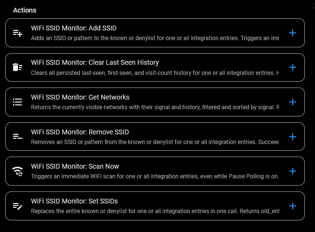

---

</details>

<br>

---

## 🔍 What You Get

This integration provides its 18 entities under a single **WiFi SSID Monitor** device - sensors, binary sensors, numbers, switches, and a button, all enabled by default.

| Category / Entity Type | Enabled / Total | Description & Key Metrics |
| :-- | :-: | :-- |
| 📊 **Sensors** | 7 / 7 | Total Count, Unknown Count, New 24h, Interface, Last Updated, Strongest Unknown SSID & Signal |
| 🔐 **Binary Sensors** | 3 / 3 | New Network Alert, Proximity Alert, Integration Health |
| 🔢 **Number Entities** | 2 / 2 | Scan Interval (1–180 min), Proximity Signal Threshold (0–100%) |
| 🔘 **Switch Entities** | 5 / 5 | Pause Polling, Include Hidden Networks, Show 2.4 / 5 / 6 GHz |
| 👆 **Button Entities** | 1 / 1 | Scan Now |
| **Total Base Install** | **18 / 18** | Complete integration entity set |

There are also six actions (services) and one event - details > [Actions & Events](#-actions-services)

<details>

<summary>
&nbsp; &nbsp; ➕ &nbsp; &nbsp; Click to Expand Entity Screenshots:
</summary><br>

| Controls and Sensors | Configuration and Diagnostics |
| :-: | :-: |
| 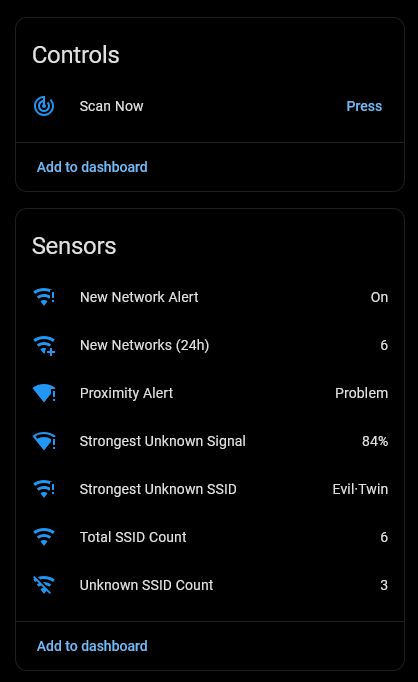 | 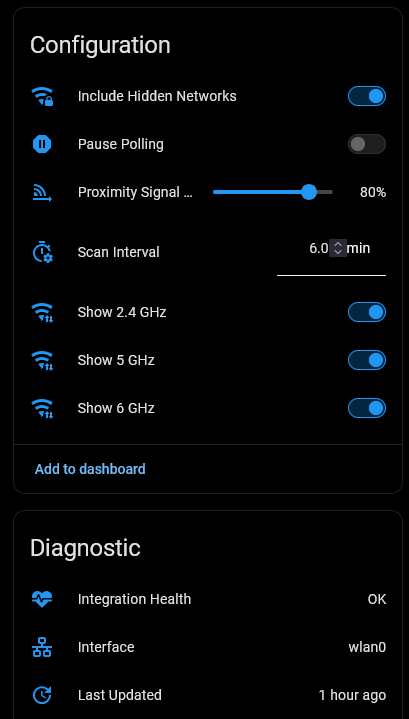 |

---

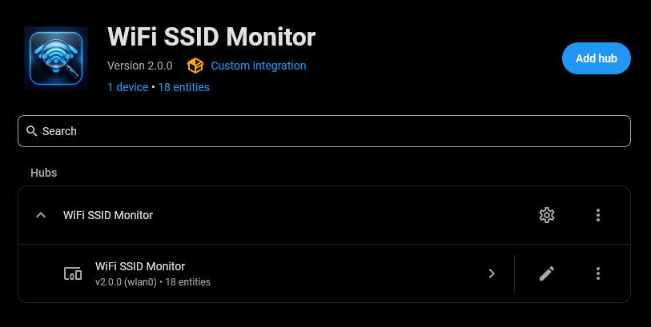

---

</details>

<br>

<details>

<summary>
&nbsp; &nbsp; ➕ &nbsp; &nbsp; Click to Expand for the full entity breakdown:
</summary><br>

---

### 📊 Sensors

| Entity | Type | Description |
| :-- | :-- | :-- |
| `sensor.wifi_ssid_monitor_total_ssid_count` | Measurement | Total number of detected WiFi networks |
| `sensor.wifi_ssid_monitor_unknown_ssid_count` | Measurement | Count of networks not in your known list |
| `sensor.wifi_ssid_monitor_last_updated` | Diagnostic | Timestamp of the last successful WiFi scan |
| `sensor.wifi_ssid_monitor_interface` | Diagnostic | Name of the monitored WiFi interface |
| `sensor.wifi_ssid_monitor_new_networks_24h` | Measurement | Networks first seen by this integration in the last 24 hours |
| `sensor.wifi_ssid_monitor_strongest_unknown_ssid` | Diagnostic | SSID name of the closest unknown network (highest signal); reads `None Detected` when no unknown networks are visible. Carries the per-network detail attributes |
| `sensor.wifi_ssid_monitor_strongest_unknown_signal` | Measurement | Signal quality of the closest unknown network (0–100%, higher is closer); `unknown` when no unknown networks are visible |

**Attributes:** The detail for each unknown network lives on **Strongest Unknown SSID**, as a `networks` list capped at the 25 strongest (with `networks_truncated: true` when more exist - use the `get_networks` action for the full set). Each entry carries `ssid`, `bssid`, `signal`, `channel`, `band`, `hidden`, `ssid_anomaly`, `first_seen`, `last_seen` and `visit_count`. The count sensors additionally expose a plain `ssids` list. All of these attributes are excluded from the recorder.

### 🔐 Binary Sensors

| Entity | Description |
| :-- | :-- |
| `binary_sensor.wifi_ssid_monitor_new_network_alert` | On when unknown networks are detected; Off when all detected networks are known. See the [Rogue Network Detection Alert](#-rogue-network-detection-alert) and [Smart Device Setup Detection](#-smart-device-setup-detection) examples |
| `binary_sensor.wifi_ssid_monitor_proximity_alert` | On when an unknown network's signal meets or exceeds the configured threshold. See the [Proximity Alert Notification](#-proximity-alert-notification) example |
| `binary_sensor.wifi_ssid_monitor_integration_health` | On when the integration detects a problem with its own data - an unreachable Supervisor, a changed payload, or all known networks vanishing at once. Always available, even during an outage; detail is in the `issues` attribute. See the [Integration Health Problem Alert](#-integration-health-problem-alert) example |

The `proximity_alert` sensor exposes `strongest_unknown_signal` (0–100% of the closest unknown network) and `threshold` (the configured limit) as state attributes.

### 🔢 Number Entities

| Entity | Default | Description |
| :-- | :-- | :-- |
| `number.wifi_ssid_monitor_scan_interval` | 10 min | Scan interval (1–180 minutes). This is now the only place the interval is set. See the [Dynamic Polling Control](#-dynamic-polling-control) example |
| `number.wifi_ssid_monitor_proximity_signal_threshold` | 80% | Signal quality (0–100%) at which the Proximity Alert fires; higher requires a closer network. See the [Proximity Alert Notification](#-proximity-alert-notification) example |

### 🔘 Switch Entities

| Entity | Default | Description |
| :-- | :-- | :-- |
| `switch.wifi_ssid_monitor_pause_polling` | Off | Pauses scheduled scans. Explicit actions (Scan Now, a control change, the `scan_now` service) still fetch. See the [Pause Scanning Overnight](#-pause-scanning-overnight) example |
| `switch.wifi_ssid_monitor_include_hidden_networks` | On | Include networks that do not broadcast a name. See the [Spoofed or Disguised Network Alert](#-spoofed-or-disguised-network-alert) example |
| `switch.wifi_ssid_monitor_show_2_4_ghz` | On | Include 2.4 GHz networks in all counts and lists |
| `switch.wifi_ssid_monitor_show_5_ghz` | On | Include 5 GHz networks in all counts and lists |
| `switch.wifi_ssid_monitor_show_6_ghz` | On | Include 6 GHz (WiFi 6E/7) networks in all counts and lists |

> [!NOTE]
>
> **Turning every band switch off shows no networks**, not all of them. Leave at least one band on.

### 👆 Button Entities

| Entity | Description |
| :-- | :-- |
| `button.wifi_ssid_monitor_scan_now` | Triggers an immediate on-demand WiFi scan, even while Pause Polling is on. See the [Security Scan on Arrival](#-security-scan-on-arrival) example |

---

</details>

<br>

> [!TIP]
>
> **Not sure what a sensor does?** Many entities carry a short built-in **About** note. Click the entity, open the **⋮ (three-dots) menu → Details** (More Info), and look for the **`about`** attribute - a one-line explanation of that entity.
>
> 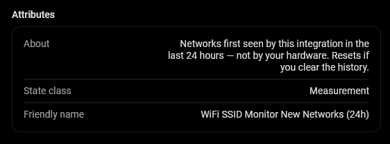
>
> These **About** notes - and the bulky per-network detail on **Strongest Unknown SSID** - are set **unrecorded**. Home Assistant still shows them live in the entity's details, but **never writes them to the history/recorder database**. That keeps informational or high-churn values from bloating your database, with no downside to what you see day-to-day.

### 📊 Long Term Statistics (LTS)

Home Assistant records Long Term Statistics for a numeric sensor **only when it declares a `state_class`**. Sensors without one still show a live value and short-term history, but are not rolled up into LTS (no hourly min/mean/max, and they can't be used in the Statistics graph). Text, IP, version, mode and timestamp sensors are never LTS candidates.

**All numeric sensors here are in LTS** - Total and unknown SSID count; Strongest unknown signal quality and new networks in the last 24 hours.

<details>

<summary>
&nbsp; &nbsp; ➕ &nbsp; &nbsp; Click to Expand for Details:
</summary><br>

| Sensors with LTS enabled | Why |
| :-- | :-- |
| `sensor.wifi_ssid_monitor_total_ssid_count` | Track WiFi network density trends over time |
| `sensor.wifi_ssid_monitor_unknown_ssid_count` | Monitor for unrecognized network spikes in your environment |
| `sensor.wifi_ssid_monitor_strongest_unknown_signal` | Monitor signal-quality trends of nearby unknown networks |
| `sensor.wifi_ssid_monitor_new_networks_24h` | Track the rate at which new networks appear |

The remaining sensors (text, timestamp, non-measurement, binary and control) do not get added to LTS based on Home Assistant design.

> [!TIP]
>
> **Want to remove a sensor from Long Term Statistics anyway?**
>
> Add a `state_class` override via [Manual Customization](https://www.home-assistant.io/integrations/homeassistant/#manual-customization) in your `configuration.yaml`. For example, to remove Total SSID Count:
>
> ```yaml
> homeassistant:
>   customize:
>     sensor.wifi_ssid_monitor_total_ssid_count:
>       state_class: none
> ```
>
> Restart Home Assistant after saving. The sensor will stop accumulating LTS from that point forward.
>
> This is a legitimate tactic, if you want to see a sensors value for this week (default retention), but not for this year.
>
> If you want to see the current value, but have no interest in short or long term history, you can [exclude a value from the Recorder](https://www.home-assistant.io/integrations/recorder/#configure-filter).
>
> And of course, if a particular sensor is of no interest to you, you can very easily disable it. Remember you don't **need** to do **any** of this. These are _extra_ options for the Home Assistant user who wants _extra_ control.

---

</details>

<br>

## 📡 Unknown Network Detection

Detecting **unknown** WiFi networks - SSIDs in range that are not on your known list - is the core of this integration. Every scan compares what the interface can see against your known list and denylist, and surfaces the rest as "unknown". That catches an "evil twin" AP imitating your SSID, a device broadcasting its own setup network after a factory reset, or simply a new neighbor's router appearing nearby.

<details>

<summary>
&nbsp; &nbsp; ➕ &nbsp; &nbsp; Click to Expand for Details:
</summary><br>

### 🧭 How to use it

1. Look at the typical signal levels of your neighbors' WiFi in the **Strongest Unknown SSID** attributes or via `get_networks` action. _(Before you add them to your denylist, this is a good way to gauge what "nearby" signal levels look like in your setup.)_
2. Set your **Proximity Signal Threshold** slightly above that normal background level (e.g. if neighbors sit around 50%, set the threshold to 70%).
3. Optionally narrow the noise: add known-friendly SSIDs to the **denylist**, or turn off a band you don't care about.
4. Set up an automation to notify you when the **Proximity Alert** turns `on`, or trigger on the `wifi_ssid_monitor_new_network` event (see the [Proximity Alert Notification](#-proximity-alert-notification) and [Alert on Any New WiFi Network using Event](#-alert-on-any-new-wifi-network-using-event) examples).

### 🔔 Sensors & Alert

- **Unknown SSID Count (`sensor.wifi_ssid_monitor_unknown_ssid_count`)**: Count of networks in range that don't match your Known SSIDs list (plus any on the denylist), after your band and hidden-network filters.
- **Strongest Unknown SSID (`sensor.wifi_ssid_monitor_strongest_unknown_ssid`)**: The name of the closest unknown network by signal; reads `None Detected` when nothing unknown is in range.
  - _Attributes_: a `networks` list (the strongest, up to 25 listed) with each network's `ssid`, `bssid`, `signal` (0–100%), `channel`, `band`, `hidden`, `ssid_anomaly`, `first_seen`, `last_seen`, and `visit_count`. `networks_truncated: true` flags if the list was capped - use the `get_networks` action for the complete set.
- **Strongest Unknown Signal (`sensor.wifi_ssid_monitor_strongest_unknown_signal`)**: The signal quality (0–100%, higher is closer) of the strongest unknown network; `unknown` when nothing unknown is visible.
- **New Networks (24h) (`sensor.wifi_ssid_monitor_new_networks_24h`)**: Count of networks this integration first saw within a rolling 24 hours (LTS-enabled for trends).
- **Proximity Alert (`binary_sensor.wifi_ssid_monitor_proximity_alert`)**: A `PROBLEM` binary sensor that turns `on` when the strongest unknown network's signal is **at or above** your **Proximity Signal Threshold** (e.g. 90% is closer/stronger than 80%). See the [Proximity Alert Notification](#-proximity-alert-notification) example.

### 🥸 Hidden & Spoofed Networks

- **Individual hidden naming**: A network that does not broadcast a name is identified from its BSSID as `Hidden-<last 4 hex>` (e.g. `Hidden-A2D3`), so distinct cloaked APs stay distinguishable instead of collapsing into one entry. Only an AP that reports no BSSID at all falls back to a shared `[hidden]` label.
- **Anomaly flag**: `ssid_anomaly` is set when a name is hidden **or** contains control, zero-width, or right-to-left characters - the toolkit for making one network's name render identically to another's. Those characters are replaced with a visible `·` marker so the difference is apparent rather than invisible. See the [Spoofed or Disguised Network Alert](#-spoofed-or-disguised-network-alert) example to alert only on this case.

### 🔧 Tuning (control entities on the device page)

- **Show 2.4 / 5 / 6 GHz** (`switch`) - include or drop each band from all counts and lists.
- **Include Hidden Networks** (`switch`) - count un-broadcast networks or ignore them entirely.
- **Proximity Signal Threshold** (`number`, 0–100%) - the "nearby" cut-off; raise it to require a closer network before the alert fires.

The **Known SSIDs** and **Always-Unknown (denylist)** lists are set in **Configure** (or via the `add_ssid` / `remove_ssid` / `set_ssids` actions). Both accept `fnmatch` wildcards and can match either the SSID or the BSSID. See [Runtime Options](#-runtime-options-configure--reconfigure). The [Dynamic Guest Network Whitelisting](#-dynamic-guest-network-whitelisting) example drives the known list from an automation.

### 🤖 On-demand & Automations

- **`get_networks` action** - query the current network set on demand with your own scope / band / signal / keyword / exclude filters (see [Actions](#-actions-services) and the [Persistent Unknown Network Digest](#-persistent-unknown-network-digest) example).
- **`wifi_ssid_monitor_new_network` event** - fires once per genuinely-new network, for triggering automations (see [Events](#-events), [Alert on Any New WiFi Network using Event](#-alert-on-any-new-wifi-network-using-event), and [Spoofed or Disguised Network Alert](#-spoofed-or-disguised-network-alert) examples).

### 🕒 Network appearance history

For each network, the integration keeps a small persisted record - `first_seen` (when HA first tracked it), `last_seen`, and `visit_count` (scan cycles seen) - pruned by the **Last Seen History TTL** option (default 90 days) plus a hard cap of 2,000 entries to bound total growth in busy locations. It powers the `first_seen` / `visit_count` fields on the `get_networks` response and the per-network detail attributes, and the **New Networks (24h)** sensor. The [Persistent Unknown Network Digest](#-persistent-unknown-network-digest) example uses `visit_count` to report only the networks that keep returning.

**Caveats:** `first_seen` is "first seen by _Home Assistant_", not by your hardware - on first install everything counts as new for 24 h. And devices using randomized MAC addresses can make **hidden** entries churn. Use `clear_last_seen` action to reset - the [Weekly History Cleanup](#-weekly-history-cleanup) example does this on a schedule.

### 📶 Signal Quality (%) vs RSSI (dBm)

This integration reports **Signal Quality as a 0–100% figure**, since that is what the Supervisor provides. Inside Home Assistant OS (HAOS), **NetworkManager** receives raw RSSI (dBm) from the kernel WiFi driver and converts it to a percentage using the standard linear formula: `Quality % = 2 × (dBm + 100)` (clamped to 0–100%).

- So every 10% signal quality corresponds to 5 dBm.

If you are used to reading WiFi signal in **RSSI (dBm)**, the table below shows the mapping used by the system:

| Signal Quality (%) | Equivalent RSSI (dBm) | Signal Level | What it means for detection |
| :-: | :-: | :-- | :-- |
| **90–100%** | $\ge -55\text{ dBm}$ | **Very Strong** | Effectively in the same room, or right next to your Home Assistant hardware ($-50\text{ dBm} = 100\%$). An unknown network this strong is worth looking at. |
| **70–90%** | $-65\text{ to }-55\text{ dBm}$ | **Strong** | Close by - typically inside your home or immediately outside it. The default **80%** Proximity Threshold ($-60\text{ dBm}$) sits in the middle of this range. |
| **50–70%** | $-75\text{ to }-65\text{ dBm}$ | **Okay** | Solidly detectable but not close. Most neighbors' networks land here - reliable to see, but not nearby. |
| **30–50%** | $-85\text{ to }-75\text{ dBm}$ | **Weak** | Distant - a few walls away or further down the street. Detected consistently, but signal quality is degraded. |
| **0–30%** | $-100\text{ to }-85\text{ dBm}$ | **Very Weak** | At the edge of detection. These networks may appear and disappear between scans as conditions shift. |

> [!NOTE]
>
> **Expected Signal Fluctuations & Hardware Variations:**
>
> While NetworkManager's conversion formula is fixed and deterministic, **expect normal fluctuations of ±5%** (up to even to ±10% in cases) in reported signal quality even for stationary hardware. These variations stem from two sources:
>
> 1. **Sequential Channel Scan Timing:** WiFi drivers scan channels sequentially. Because beacon frames for different SSIDs are captured at slightly different milliseconds, minor multipath reflections and ambient RF noise cause scan-to-scan variations of ~5% across identical physical networks.
> 2. **Movement of People & Things:** A person or a chair etc., near your Home Assistant hardware and moving slightly will cause variations.
> 3. **Hardware & Antenna Sensitivity:** Different WiFi card chip-sets and internal antenna orientations measure raw signal with slight variations. Two physical systems placed next to each other may easily report a ~5% reading difference for the exact same Access Point.
>
> **The Takeaway**: Even in a very static set-up, some variation is inevitable. With movement, this can increase. So, _"why is this signal fluctuating between 75% and 80%"_ is not a concern. When _Super-Suspicious-SSID_ goes from 30% to 80% signal, that **IS WORTH** some investigation!
>
> **Calibrate against your own environment:** Run `wifi_ssid_monitor.get_networks` with `scope: unknown` and look at the spread of values your hardware actually reports - that is what should set your Proximity Threshold. In a dense area the 80% default may be too permissive; somewhere quiet it may be about right.

---

</details>

<br>

## 🔘 Controls & Settings

Several settings are exposed as control entities so you can drive them from dashboards or automations, rather than reopening Configure:

<details>

<summary>
&nbsp; &nbsp; ➕ &nbsp; &nbsp; Click to Expand for Details:
</summary><br>

### 🔩 Runtime Controls & Settings (Entities)

- **Pause Polling** (`switch`) - halt scheduled scanning temporarily. Manual actions (Scan Now, a control change, `scan_now`) still fetch while paused. See the [Pause Scanning Overnight](#-pause-scanning-overnight) example.
- **Scan Interval** (`number`) - minutes between scheduled scans (1–180, default 10). This is the only place the interval is set. See the [Dynamic Polling Control](#-dynamic-polling-control) example.
- **Proximity Signal Threshold** (`number`) - signal quality (0–100%) at or above which an unknown network trips the Proximity Alert (default 80%). See the [Proximity Alert Notification](#-proximity-alert-notification) example.
- **Include Hidden Networks** (`switch`) - count un-broadcast networks or ignore them entirely (default on). See the [Spoofed or Disguised Network Alert](#-spoofed-or-disguised-network-alert) example.
- **Show 2.4 GHz / Show 5 GHz / Show 6 GHz** (`switch` × 3) - include or drop each band from all counts and lists (all default on).
- **Scan Now** (`button`) - an immediate on-demand scan (works even while Pause Polling is on). See the [Security Scan on Arrival](#-security-scan-on-arrival) example.

Changing any of these applies **immediately** - even while Pause Polling is on, an explicit change triggers a fresh scan (a bare scan-interval change just re-arms the timer).

| Configuration | Controls |
| :-: | :-: |
| 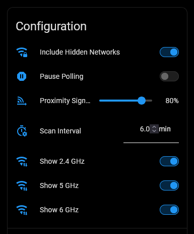 | 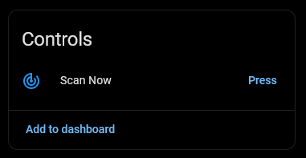 |

---

### 🔧 Explaining the Configuration Options

#### 1. Wildcard SSID Matching (Known & Always-Unknown)

SSID matching supports standard shell wildcards (`fnmatch` patterns):

- `*` - Matches anything, including an empty string (e.g., `Guest_*` matches `Guest_Home` and `Guest_`).
- `?` - Matches any single character (e.g., `IoT_?` matches `IoT_1` but not `IoT_12`).
- `[seq]` - Matches any character in the sequence (e.g., `Home_[12]` matches `Home_1` and `Home_2`).

#### 2. Proximity Signal Threshold & Signal Quality

The Supervisor reports signal as a **0–100% quality figure**, and the Proximity Threshold is set on the same scale. Higher is closer:

See [Signal Quality vs RSSI](#-signal-quality--vs-rssi-dbm) for more details.

Raise the threshold if the alert is noisy in a dense WiFi environment; lower it to catch more distant networks.

#### 3. Last Seen History TTL

The integration keeps track of how often and when unknown networks are seen:

- `first_seen` - Timestamp of the very first scan cycle the SSID was detected.
- `last_seen` - Timestamp of the most recent scan cycle the SSID was detected.
- `visit_counts` - Total number of scan cycles in which the SSID has appeared. To prevent storage bloat, any SSID that has not been seen for longer than the TTL window is pruned automatically from history on the next scan. Setting this to `0` disables pruning.

---

</details>
<br>

## 🧹 Actions (Services)

Six callable actions (services) cover the full management lifecycle - add, remove, or replace the known and denylist, query live networks (get_networks), trigger on-demand scans, and clear history.

<details>

<summary>
&nbsp; &nbsp; ➕ &nbsp; &nbsp; Click to Expand for Details:
</summary><br>

All actions accept an optional `config_entry_id` to target a specific integration entry. Leave it blank to apply to all configured entries.

The list-management services take a `target` of `known` or `denylist`, so the same three actions manage both lists.

| Action / Service | Type | Description |
| :-- | :-: | :-- |
| `wifi_ssid_monitor.add_ssid` | Command | Adds an SSID or pattern to the known or denylist; triggers an immediate re-scan |
| `wifi_ssid_monitor.remove_ssid` | Command | Removes an SSID or pattern from the known or denylist; triggers a re-scan if the list changes |
| `wifi_ssid_monitor.set_ssids` | Response | Replaces the entire known or denylist; returns the new and previous lists as response data |
| `wifi_ssid_monitor.scan_now` | Command | Triggers an immediate WiFi scan, even while Pause Polling is on |
| `wifi_ssid_monitor.clear_last_seen` | Command | Clears all `last_seen`, `first_seen`, and `visit_counts` history |
| `wifi_ssid_monitor.get_networks` | Response | Returns the current networks with signal and history, filtered and sorted - a response action |

---

### `add_ssid` / `remove_ssid`

Adds or removes an SSID or wildcard pattern to/from the known list or denylist. See the [Dynamic Guest Network Whitelisting](#-dynamic-guest-network-whitelisting) example.

| Parameter         |  Type  | Required | Description                                  |
| :---------------- | :----: | :------: | :------------------------------------------- |
| `ssid`            | String | **Yes**  | SSID or pattern to add/remove                |
| `target`          |  Enum  | **Yes**  | `known` or `denylist`                        |
| `config_entry_id` | String |    No    | Target a specific entry; blank = all entries |

```yaml
action: wifi_ssid_monitor.add_ssid
data:
  ssid: "My_WiFi_24G"
  target: known
```

<details>

<summary>
&nbsp; &nbsp; ➕ &nbsp; &nbsp; Click to Expand for Screenshot:
</summary><br>

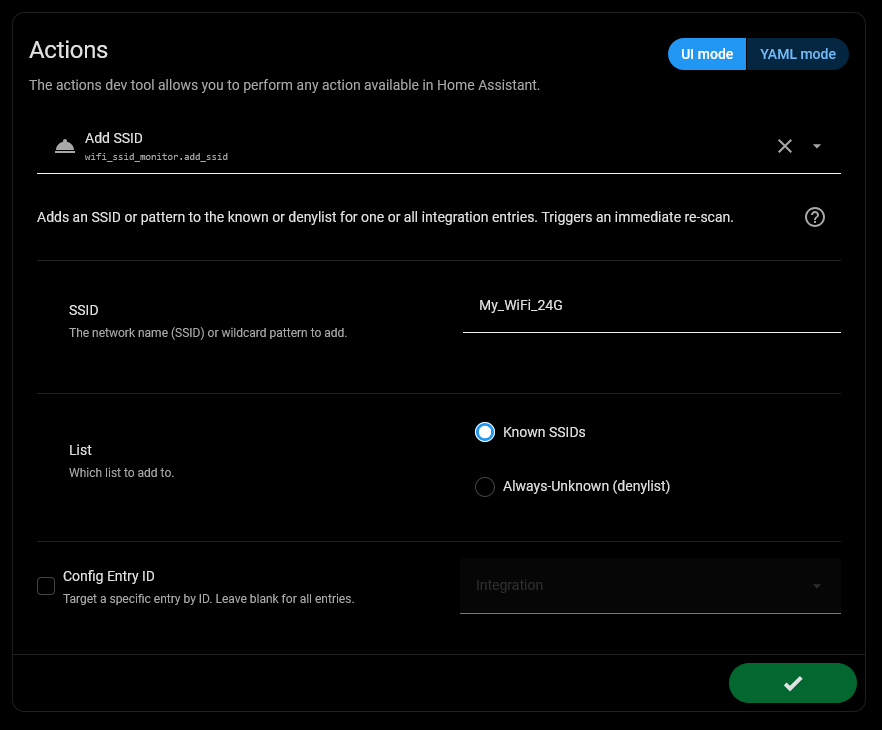

---

</details>

<br>

---

### `set_ssids`

Replaces the entire known **or** denylist in one call. Returns the new and previous lists per entry for undo/audit capabilities.

| Parameter | Type | Required | Description |
| :-- | :-: | :-: | :-- |
| `values` | String | **Yes** | Comma-separated SSIDs and patterns - replaces the target list entirely |
| `target` | Enum | **Yes** | `known` or `denylist` |
| `config_entry_id` | String | No | Target a specific entry; blank = all entries |

```yaml
action: wifi_ssid_monitor.set_ssids
response_variable: result
data:
  values: "My_WiFi_24G, My_WiFi_5G, Neighbors_WiFi*"
  target: known
```

<details>

<summary>
&nbsp; &nbsp; ➕ &nbsp; &nbsp; Click to Expand for Screenshot:
</summary><br>

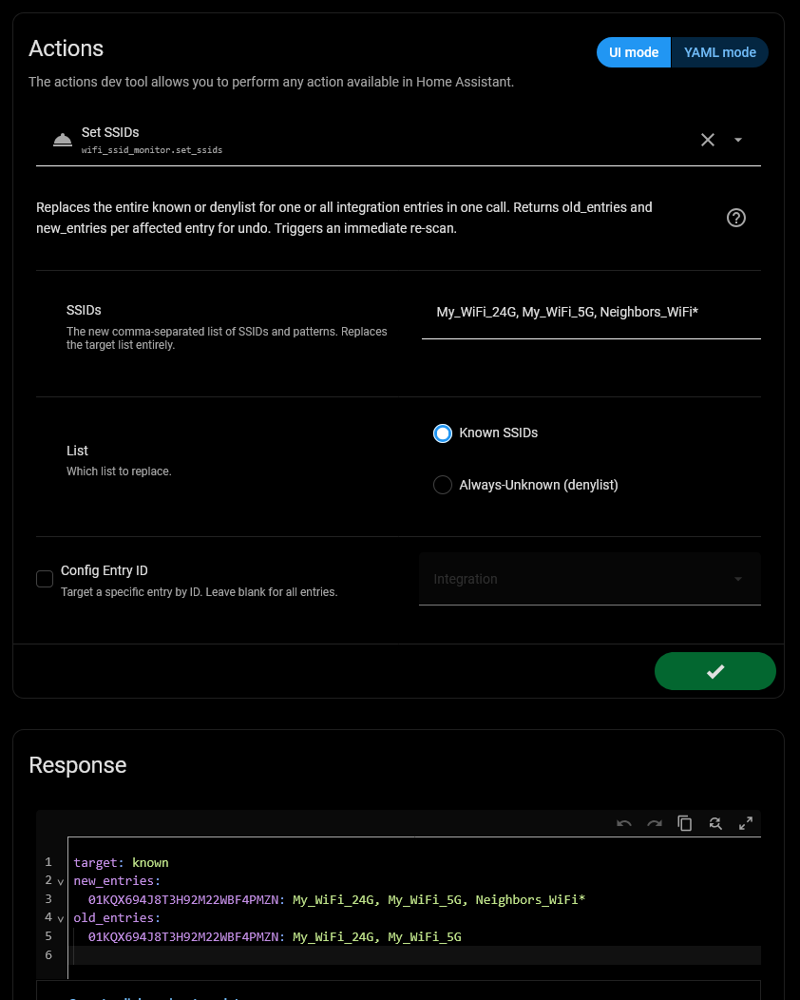

---

</details>

<br>

---

### `scan_now` / `clear_last_seen`

Both take only the optional `config_entry_id`. `scan_now` fetches even while Pause Polling is on; `clear_last_seen` clears all three history stores. See the [Security Scan on Arrival](#-security-scan-on-arrival) and [Weekly History Cleanup](#-weekly-history-cleanup) examples.

<details>

<summary>
&nbsp; &nbsp; ➕ &nbsp; &nbsp; Click to Expand for Screenshots:
</summary><br>

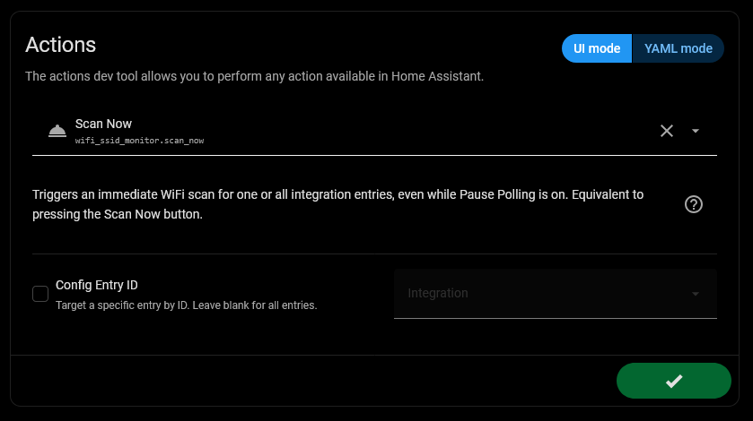

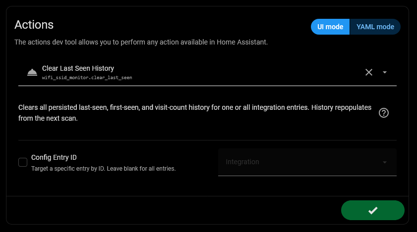

---

</details>

<br>

---

### `get_networks`

Returns the currently visible networks with their signal and history, filtered and sorted by signal. Reads live scan data directly, so it works even when the passive sensors are unavailable or their attribute list is capped. See the [Persistent Unknown Network Digest](#-persistent-unknown-network-digest) example.

> [!TIP]
>
> **Instant Diagnostic Inspection**: You can run `wifi_ssid_monitor.get_networks` directly from **Tools > Actions** in the Home Assistant UI to inspect live network data immediately without creating an automation.

| Parameter | Type | Required | Description |
| :-- | :-: | :-: | :-- |
| `scope` | Enum | No | `unknown` (default), `known`, or `all` |
| `band` | Enum | No | `2.4`, `5`, `6`, or `all` (default) |
| `min_signal` | Integer | No | Only include networks at or above this quality (0–100%) |
| `quantity` | Integer | No | Maximum to return (default 50, max 500) |
| `keyword` / `exclude` | String | No | Comma-separated include/exclude terms |
| `config_entry_id` | String | No | Target a specific entry; blank = all entries |

```yaml
action: wifi_ssid_monitor.get_networks
response_variable: result
data:
  scope: unknown
  min_signal: 60
```

The response carries `networks` (the capped list), `count` (the number returned, after the `quantity` cap), and `total_matched` (the true match count before the cap), plus two fields describing how current the data is:

| Field | Description |
| :-- | :-- |
| `last_updated` | ISO timestamp of the scan this data came from, or `null` if no scan has succeeded yet |
| `stale` | `true` if the last scan failed, so the networks below are the last good result rather than a fresh one |

> [!NOTE]
>
> This action **reads the most recent scan rather than triggering a new one**, so it is cheap to call and safe to poll. Check `stale` if that matters to your automation, or call `wifi_ssid_monitor.scan_now` first when you specifically need current data - it fetches even while Pause Polling is on.

Each entry in `networks` carries the following fields:

| Field | Description |
| :-- | :-- |
| `entry_id` | The config entry that saw the network |
| `ssid` | Display name (`Hidden-<last 4 of BSSID>` for a cloaked network) |
| `bssid` | Access point MAC, where reported |
| `signal` | Signal quality 0–100% (higher is closer); the list is sorted by this, strongest first |
| `channel` | WiFi channel, where derivable |
| `band` | `2.4 GHz` / `5 GHz` / `6 GHz`, or `null` if undetermined |
| `hidden` | `true` if the network does not broadcast a name |
| `ssid_anomaly` | `true` if the name is hidden or contains control/zero-width/RTL characters |
| `mode` | Reported AP mode, where present |
| `known` | `true` if the network matches your known list (and is not on the denylist) |
| `first_seen` | ISO timestamp this integration first saw the network |
| `last_seen` | ISO timestamp of the most recent scan the network was seen |
| `visit_count` | Number of scan cycles the network has been seen in |

<details>

<summary>
&nbsp; &nbsp; ➕ &nbsp; &nbsp; Click to Expand for Screenshot:
</summary><br>

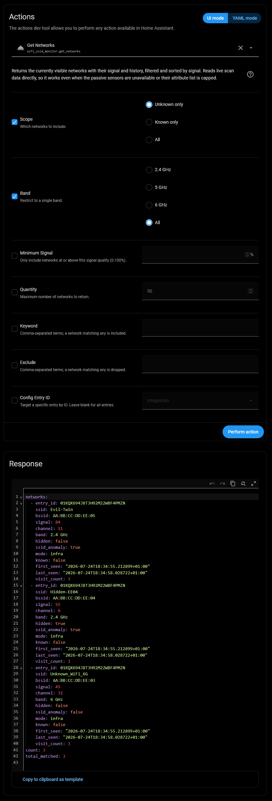

</details>

<br>

---

</details>

<br>

### 📣 Events

Alongside the actions, the integration fires a bus event you can use as an automation trigger. It fires **once** per newly-seen network, records the existing set silently on startup or after a history reset (no replay), and is rate-limited to 10 per scan cycle.

See the [Alert on Any New WiFi Network using Event](#-alert-on-any-new-wifi-network-using-event) and [Spoofed or Disguised Network Alert](#-spoofed-or-disguised-network-alert) examples.

<details>

<summary>
&nbsp; &nbsp; ➕ &nbsp; &nbsp; Click to Expand for Details:
</summary><br>

The integration fires a `wifi_ssid_monitor_new_network` event on the Home Assistant event bus each time a **genuinely new** network is seen for the first time. Unlike the `new_network_alert` binary sensor (which is simply on/off while any unknown network is present), this event fires once **per network** and survives restarts - the existing set is recorded silently on the first scan after start or a history reset, so a restart never replays the backlog. Emission is rate-limited to 10 events per scan cycle (any excess is counted and logged, never silently dropped).

| Event type | Fires when | `trigger.event.data` fields |
| :-- | :-- | :-- |
| `wifi_ssid_monitor_new_network` | A network is seen for the first time | `entry_id`, `key`, `ssid`, `bssid`, `band`, `channel`, `signal`, `hidden`, `ssid_anomaly`, `mode`, `first_seen` |

Payload fields:

| Field | Description |
| :-- | :-- |
| `entry_id` | The config entry that saw the network |
| `key` | Stable history key (the SSID, or `hidden:<bssid>` for a cloaked network) |
| `ssid` | Display name (`Hidden-<last 4 of BSSID>` for a cloaked network) |
| `bssid` | Access point MAC, where reported |
| `band` | `2.4 GHz` / `5 GHz` / `6 GHz`, or `null` if undetermined |
| `channel` | WiFi channel, where derivable |
| `signal` | Signal quality 0–100% |
| `hidden` | `true` if the network does not broadcast a name |
| `ssid_anomaly` | `true` if the name is hidden or contains control/zero-width/RTL characters |
| `mode` | Reported AP mode, where present |
| `first_seen` | ISO timestamp this integration first saw the network |

---

</details>

<br>

## 💡 Example Automations

> [!NOTE]
>
> Entity IDs are derived from your integration/device name (e.g. `sensor.wifi_ssid_monitor_...`) and **may differ between installs**, or if you have renamed entities. Use the entity picker in the Automation editor rather than copying the IDs below verbatim. The examples are illustrative.

---

> [!NOTE]
>
> The Automation examples below use the `note:` functionality introduced in Home Assistant 2026.6 as a way to document/comment Automations that is permanent and **not** stripped out by the editor. If using an older version of Home Assistant you may need to remove the `note:` sections

---

> [!NOTE]
>
> Use your own preferred Automation notifier

<details>

<summary>&nbsp; &nbsp; &nbsp; &nbsp; ➕ &nbsp; Click to Expand for Notification Options:
</summary><br>

Replace

```yaml
action: persistent_notification.create
```

with

```yaml
action: notify.send_message
target:
  entity_id: notify.your_specific_mobile_phone
```

---

</details>

### 🔒 Security & Detection Automations

#### 🚨 Rogue Network Detection Alert

<details>

<summary> &nbsp; &nbsp; Notify when an unknown network is detected.<br>
&nbsp; &nbsp; &nbsp; &nbsp; ➕ &nbsp; Click to Expand for Automation Detail:
</summary><br>

```yaml
alias: "WiFi SSID: Alert on Rogue WiFi Network"
triggers:
  - trigger: state
    entity_id: binary_sensor.wifi_ssid_monitor_new_network_alert
    from: "off"
    to: "on"
    note: |
      Fires on the transition to on - when at least one network
      not matching your known list becomes visible. It stays on
      while any unknown network is present, so this triggers
      once per appearance, not once per network.
actions:
  - action: persistent_notification.create
    data:
      message: |
        Unknown WiFi network detected: {{ states('sensor.wifi_ssid_monitor_unknown_ssid_count') }} unknown network(s) found
    note: |
      Reports how many unknown networks are currently visible.
      The unknown count sensor also carries an ssids attribute
      listing their names.
```

---

</details>

#### 📡 Proximity Alert Notification

<details>

<summary> &nbsp; &nbsp; Alert when an unknown network is detected unusually close (signal at/above your threshold).<br>
&nbsp; &nbsp; &nbsp; &nbsp; ➕ &nbsp; Click to Expand for Automation Detail:
</summary><br>

```yaml
alias: "WiFi SSID: Alert on Nearby Unknown WiFi"
description: "Fires when an unknown network signal exceeds the proximity threshold"
triggers:
  - trigger: state
    entity_id: binary_sensor.wifi_ssid_monitor_proximity_alert
    from: "off"
    to: "on"
    note: |
      Fires when an unknown network's signal quality reaches
      the Proximity Signal Threshold number entity (80% by default).
      Raise that number to alert only on very close networks,
      lower it to catch weaker ones.
actions:
  - action: persistent_notification.create
    data:
      message: |
        Unknown WiFi detected nearby! Signal: {{ state_attr('binary_sensor.wifi_ssid_monitor_proximity_alert', 'strongest_unknown_signal') }}%. Networks: {{ state_attr('sensor.wifi_ssid_monitor_unknown_ssid_count', 'ssids') | join(', ') }}
    note: |
      Signal is a 0-100 quality percentage. Higher is closer.
      See the Signal Quality vs RSSI section for the approximate
      mapping.
```

---

</details>

#### 📟 Alert on Any New WiFi Network using Event

<details>

<summary> &nbsp; &nbsp; Detect any new WiFi Network using the Event trigger. <br>
&nbsp; &nbsp; &nbsp; &nbsp; ➕ &nbsp; Click to Expand for Automation Detail:
</summary><br>

```yaml
alias: "WiFi SSID: Alert on Any New Network via Event"
triggers:
  - trigger: event
    event_type: wifi_ssid_monitor_new_network
    note: |
      Fires once per network the first time it is ever seen,
      known or unknown. The existing set is recorded silently
      on the first scan after a restart or history reset,
      so this never replays a backlog. Emission is capped at 10
      per scan cycle.
actions:
  - action: persistent_notification.create
    data:
      message: |
        New WiFi network seen: {{ trigger.event.data.ssid }} ({{ trigger.event.data.band }}, {{ trigger.event.data.signal }}%)
    note: |
      trigger.event.data also carries entry_id, key, bssid,
      channel, hidden, ssid_anomaly, mode, and first_seen.
      band is null when it could not be determined.
```

---

</details>

#### 🎭 Spoofed or Disguised Network Alert

<details>

<summary> &nbsp; &nbsp; Alert only when a new network's name contains characters used to impersonate another network.<br>
&nbsp; &nbsp; &nbsp; &nbsp; ➕ &nbsp; Click to Expand for Automation Detail:
</summary><br>

A network name containing control, zero-width, or right-to-left characters can render as an existing network's name while being a different network entirely. This automation ignores ordinary new networks and fires only on that case.

> [!IMPORTANT]
>
> The `not trigger.event.data.hidden` condition is required. `ssid_anomaly` is also `true` for every cloaked (non-broadcasting) network, so without this guard the automation fires for ordinary hidden networks as well.

```yaml
alias: "WiFi SSID: Alert on Disguised Network Name"
description: "Fires when a new network name contains impersonation characters"
triggers:
  - trigger: event
    event_type: wifi_ssid_monitor_new_network
    note: |
      Fires for every genuinely new network; the condition
      below discards all but the suspicious ones.
conditions:
  - condition: template
    alias: Anomalous name, but not merely a hidden network
    value_template: |
      {{ trigger.event.data.ssid_anomaly and not trigger.event.data.hidden }}
    note: |
      ssid_anomaly is true for a name containing control,
      zero-width, or right-to-left characters - and also for any
      cloaked network. The hidden check is required: without it
      this fires for every ordinary non-broadcasting network too.
actions:
  - action: persistent_notification.create
    data:
      title: Possible spoofed WiFi network
      message: |
        A new network with a disguised name was seen: {{ trigger.event.data.ssid }} (BSSID {{ trigger.event.data.bssid }}, {{ trigger.event.data.band }}, {{ trigger.event.data.signal }}%).
    note: |
      The BSSID is important as well as the name here - the name is
      what is being disguised, so the access point MAC is the
      reliable identifier for tracking it down.
```

---

</details>

#### 🔁 Persistent Unknown Network Digest

<details>

<summary> &nbsp; &nbsp; Report unknown networks that keep coming back, ignoring one-off passers-by.<br>
&nbsp; &nbsp; &nbsp; &nbsp; ➕ &nbsp; Click to Expand for Automation Detail:
</summary><br>

The `new_network_alert` binary sensor cannot tell a neighbor's permanent access point from a phone hotspot that drove past once. This uses the `get_networks` response action and its `visit_count` and `first_seen` fields to report only the networks that have been seen repeatedly.

```yaml
alias: "WiFi SSID: Daily Persistent Unknown Network Digest"
description: "Reports unknown networks seen repeatedly, not one-off sightings"
mode: single
triggers:
  - trigger: time
    at: "09:00:00"
    note: "Morning digest - adjust the time to suit."
actions:
  - action: wifi_ssid_monitor.get_networks
    data:
      scope: unknown
      min_signal: 60
    response_variable: result
    note: |
      Reads live scan data directly, so it works even when the
      passive sensors are unavailable. The result lands in the
      result variable as {count, total_matched, networks:
      [{ssid, signal, visit_count, first_seen, ...}]}.
      Add config_entry_id if you run more than one entry and
      want only one of them.
  - variables:
      persistent: |
        {{ result.networks | selectattr('visit_count')
           | selectattr('visit_count', '>', 20) | list }}
    note: |
      Keeps only networks seen more than 20 times. The bare
      selectattr('visit_count') first drops any network with no
      recorded count, so the comparison never sees null.
  - condition: template
    value_template: "{{ persistent | count > 0 }}"
    note: "Stop here (no notification) when nothing has been seen repeatedly."
  - action: persistent_notification.create
    data:
      title: Recurring unknown WiFi networks
      message: |
         {{ net.ssid }} - {{ net.signal }}%, seen {{ net.visit_count }} times since {{ net.first_seen }} 
    note: |
      One line per recurring network. Each net also carries
      bssid, band, channel, hidden, ssid_anomaly, mode, known,
      and last_seen.
```

> [!TIP]
>
> Tune `visit_count` to your scan interval. At a 10 minute interval, `20` is roughly three hours of presence; at a 60 minute interval it is closer to a day.

---

</details>

#### 📟 Smart Device Setup Detection

<details>

<summary> &nbsp; &nbsp; Detect when a smart home device enters access point (pairing) mode.<br>
&nbsp; &nbsp; &nbsp; &nbsp; ➕ &nbsp; Click to Expand for Automation Detail:
</summary><br>

```yaml
alias: "WiFi SSID: Alert if Device in AP Mode"
triggers:
  - trigger: state
    entity_id: binary_sensor.wifi_ssid_monitor_new_network_alert
    from: "off"
    to: "on"
    note: |
      A device that has been reset, or is new out of the box,
      broadcasts its own setup network - which appears here as an
      unknown network. Specify both from and to to avoid
      unknown or unavailable state transitions.
conditions:
  - condition: template
    alias: Check If Unknown SSID Is a Known Smart Device
    value_template: |
      
      
      {{ device_aps | select('in', ssids) | list | length > 0 }}
    note: |
      device_aps is the control - replace these placeholders with
      the setup-network name prefixes your own brands use.
      Matching is a lowercased substring test.
actions:
  - action: persistent_notification.create
    data:
      message: |
        Smart Device in AP Mode Detected: {{ states('sensor.wifi_ssid_monitor_unknown_ssid_count') }} APs found.
    note: |
      Reports the total unknown count, which may include
      networks other than the matched device. Use the ssids
      attribute if you want to name the matches specifically.
```

> [!TIP]
>
> Set the `device_aps` list above to meet your requirements, e.g. ['shelly' ,'esp32'] etc.

---

</details>

#### 🌐 Home WiFi Offline Alert

<details>

<summary> &nbsp; &nbsp; Monitor whether one of your own networks has stopped broadcasting.<br>
&nbsp; &nbsp; &nbsp; &nbsp; ➕ &nbsp; Click to Expand for Automation Detail:
</summary><br>

> [!IMPORTANT]
>
> The `3` in the trigger is **your own base count** - see the trigger `note:` below.

```yaml
alias: "WiFi SSID: Alert if Home WiFi Offline"
description: "Warns when the number of your own networks drops below normal"
triggers:
  - trigger: template
    value_template: |
      {{ has_value('sensor.wifi_ssid_monitor_total_ssid_count') and
         has_value('sensor.wifi_ssid_monitor_unknown_ssid_count') and
         ((states('sensor.wifi_ssid_monitor_total_ssid_count') | int(0)) -
          (states('sensor.wifi_ssid_monitor_unknown_ssid_count') | int(0))) < 3 }}
    for:
      minutes: 10
    note: |
      Watches your base count - total networks minus unknown
      ones - which is how many of your own networks are
      broadcasting. Subtracting unknown means a neighbor's
      network drifting in and out never moves it. Checks
      has_value() to ensure scanner entities are online and
      valid before evaluating. Set the < 3 to your own base:
      if you normally see 4 total with 1 unknown, your base
      is 3, so < 3 fires the moment it drops to 2. The 10 minute
      duration rides out a single unlucky scan - set it to
      about double your scan interval.
conditions:
  - condition: state
    alias: Ignore a low count caused by the integration itself failing
    entity_id: binary_sensor.wifi_ssid_monitor_integration_health
    state: "off"
    note: |
      A missing interface or a failed Supervisor call drives the
      total to zero, which would also pull the base below the
      threshold. That is a fault in this integration's data, not
      evidence your router is down - Integration Health reports
      it separately, so this stays silent for it.
actions:
  - action: persistent_notification.create
    data:
      message: |
        A home network may be offline - only {{ (states('sensor.wifi_ssid_monitor_total_ssid_count') | int(0))
           - (states('sensor.wifi_ssid_monitor_unknown_ssid_count') | int(0)) }}
        of your networks are broadcasting.
    note: |
      Only reaches here when the base is genuinely low and the
      integration itself is healthy. The message recomputes the
      base so it names the current number.
```

---

</details>

### 🔄 Polling & Scanning Automations

#### 🔍 Security Scan on Arrival

<details>

<summary> &nbsp; &nbsp; Trigger an immediate scan the moment someone arrives home.<br>
&nbsp; &nbsp; &nbsp; &nbsp; ➕ &nbsp; Click to Expand for Automation Detail:
</summary><br>

```yaml
alias: "WiFi SSID: Scan on Arrival"
description: "Runs an on-demand WiFi scan when someone arrives home"
triggers:
  - trigger: state
    entity_id: person.your_name
    from: "not_home"
    to: "home"
    note: "Replace person.your_name with your own person or device_tracker entity."
actions:
  - action: button.press
    target:
      entity_id: button.wifi_ssid_monitor_scan_now
    note: |
      Runs a scan immediately rather than waiting for the next
      interval. It works even while Pause Polling is on - an
      explicit request is always honored - and raises an error
      if the scan fails, so the automation reports rather than
      silently doing nothing.
```

---

</details>

#### 🔄 Dynamic Polling Control

<details>

<summary> &nbsp; &nbsp; Automatically adjust the scan frequency between day and evening hours.<br>
&nbsp; &nbsp; &nbsp; &nbsp; ➕ &nbsp; Click to Expand for Automation Detail:
</summary><br>

```yaml
alias: "WiFi SSID: Set Scan Interval Based on Time"
description: "Adjusts SSID scan interval for day and evening cycles"
mode: single
triggers:
  - trigger: time
    at: "08:00:00"
    id: "day"
    note: "Switch to the relaxed daytime cadence."
  - trigger: time
    at: "18:00:00"
    id: "evening"
    note: "Switch to the slower evening cadence."
actions:
  - choose:
      - conditions:
          - condition: trigger
            id: "day"
        sequence:
          - action: number.set_value
            target:
              entity_id: number.wifi_ssid_monitor_scan_interval
            data:
              value: 10
            note: |
              Scan every 10 minutes. Changing the interval takes
              effect immediately and does not force an extra scan -
              the next one lands on the new schedule.
      - conditions:
          - condition: trigger
            id: "evening"
        sequence:
          - action: number.set_value
            target:
              entity_id: number.wifi_ssid_monitor_scan_interval
            data:
              value: 20
            note: |
              Scan every 20 minutes. Use the Pause Polling switch
              instead if you want no scanning at all rather than less
              of it.
```

---

</details>

#### 🌙 Pause Scanning Overnight

<details>

<summary> &nbsp; &nbsp; Suspend polling during hours you do not care about, and resume in the morning.<br>
&nbsp; &nbsp; &nbsp; &nbsp; ➕ &nbsp; Click to Expand for Automation Detail:
</summary><br>

While `Pause Polling` is on, no scans run at all and the sensors hold their last values. This is the lighter-touch alternative to lengthening the scan interval when you want _no_ activity rather than less of it.

```yaml
alias: "WiFi SSID: Pause Scanning Overnight"
description: "Suspends WiFi scanning overnight and resumes it in the morning"
mode: single
triggers:
  - trigger: time
    at: "23:30:00"
    id: "pause"
    note: "Stop scanning for the night."
  - trigger: time
    at: "07:00:00"
    id: "resume"
    note: "Resume scanning in the morning."
actions:
  - choose:
      - conditions:
          - condition: trigger
            id: "pause"
        sequence:
          - action: switch.turn_on
            target:
              entity_id: switch.wifi_ssid_monitor_pause_polling
            note: |
              No scans run at all while this is on and the sensors
              hold their last values. The Scan Now button still
              works if you ask for a scan explicitly.
      - conditions:
          - condition: trigger
            id: "resume"
        sequence:
          - action: switch.turn_off
            target:
              entity_id: switch.wifi_ssid_monitor_pause_polling
            note: |
              Resuming restores the normal schedule but does not
              fetch immediately, so the first fresh data would
              otherwise arrive up to one interval later.
          - action: button.press
            target:
              entity_id: button.wifi_ssid_monitor_scan_now
            note: "Closes that gap by scanning straight away."
```

---

</details>

### 🧹 List & History Management Automations

#### 🔀 Dynamic Guest Network Whitelisting

<details>

<summary> &nbsp; &nbsp; Whitelist a guest network when its switch turns on, and remove it when it turns off.<br>
&nbsp; &nbsp; &nbsp; &nbsp; ➕ &nbsp; Click to Expand for Automation Detail:
</summary><br>

```yaml
alias: "WiFi SSID: Manage Guest Network Whitelist"
description: "Dynamically updates known networks when Guest WiFi status changes"
mode: single
triggers:
  - trigger: state
    entity_id: switch.router_guest_wifi
    not_from:
      - "unknown"
      - "unavailable"
    not_to:
      - "unknown"
      - "unavailable"
    note: |
      Your router integration's guest-network switch, not one of
      this integration's. Ignores unknown and unavailable states
      so router reconnects do not trigger whitelist actions.
actions:
  - choose:
      - conditions:
          - condition: state
            entity_id: switch.router_guest_wifi
            state: "on"
        sequence:
          - action: wifi_ssid_monitor.add_ssid
            data:
              ssid: "MyGuestWiFi_*"
              target: known
            note: |
              Adds the pattern to the known list so the guest network
              stops being reported as unknown. The trailing * is a
              wildcard, matching any suffix your router appends.
              add_ssid is additive - it leaves the rest of the list
              alone.
      - conditions:
          - condition: state
            entity_id: switch.router_guest_wifi
            state: "off"
        sequence:
          - action: wifi_ssid_monitor.remove_ssid
            data:
              ssid: "MyGuestWiFi_*"
              target: known
            note: |
              Removes the same pattern again, so the network would be
              flagged if it ever reappeared while it is meant to be
              off. The pattern must match what was added, exactly.
```

---

</details>

#### 🧹 Weekly History Cleanup

<details>

<summary> &nbsp; &nbsp; Prune the persistent scan history once a week.<br>
&nbsp; &nbsp; &nbsp; &nbsp; ➕ &nbsp; Click to Expand for Automation Detail:
</summary><br>

Prevents the list of temporary, one-off unknown SSIDs from growing too large.

```yaml
alias: "WiFi SSID: Weekly History Reset"
description: "Clears persistent last-seen, first-seen, and visit-count history weekly"
triggers:
  - trigger: time
    at: "00:00:00"
    note: "Fires every night; the condition below narrows it to one night a week."
conditions:
  - condition: time
    weekday:
      - sun
    note: "Sunday only - change the weekday, or add more, to reset more often."
actions:
  - action: wifi_ssid_monitor.clear_last_seen
    note: |
      Clears all first-seen, last-seen, and visit-count history.
      Your known and always-unknown SSID lists are configuration
      and are not touched. Note that after a reset the next scan
      silently re-records everything currently visible, so the
      new network event does not replay a backlog.
```

---

</details>

### 🩺 Diagnostics & Health Automations

#### 🩹 Integration Health Problem Alert

<details>

<summary> &nbsp; &nbsp; Be told when the integration detects a fault in its own data.<br>
&nbsp; &nbsp; &nbsp; &nbsp; ➕ &nbsp; Click to Expand for Automation Detail:
</summary><br>

The `Integration Health` binary sensor turns on when the integration's self-checks find a problem - a missing interface, a change in the shape or units of the Supervisor response, or a scan that returned nothing. It stays available even when scanning has failed, so it can report the fault that made the other entities unreliable.

```yaml
alias: "WiFi SSID: Integration Health Problem"
description: "Notifies when the integration's self-checks detect a problem"
mode: single
triggers:
  - trigger: state
    entity_id: binary_sensor.wifi_ssid_monitor_integration_health
    from: "off"
    to: "on"
    for:
      minutes: 10
    note: |
      The 10 minute duration is deliberate. A single failed scan
      can set the sensor briefly and clear on the next cycle;
      this reports only problems that persist. Shorten it if
      you would rather hear about transient faults too.
actions:
  - action: persistent_notification.create
    data:
      title: WiFi SSID Monitor needs attention
      message: |
        {{ state_attr('binary_sensor.wifi_ssid_monitor_integration_health', 'issues')
           | join(', ') }}
        Last good scan: {{ state_attr('binary_sensor.wifi_ssid_monitor_integration_health', 'last_good_update') }}
    note: |
      issues is a list of human-readable problem descriptions.
      The sensor also carries severity, degraded_capabilities
      (the check names, for filtering), signal_unit, and
      networks_scanned.
```

---

</details>

## 📥 Installation

### ✨ HACS (Recommended)

[](https://my.home-assistant.io/redirect/hacs_repository/?owner=PlayFaster&repository=ha-wifi-ssid-monitor&category=integration)

Use the **shortcut badge** above, then proceed to Step 3 - or just …

1. Add this [repository](https://github.com/PlayFaster/ha-wifi-ssid-monitor) as a **Custom Repository** in HACS:
   - Open HACS in Home Assistant
   - Click **Custom repositories** (⋮ menu)
   - Add repository URL and Type: `Integration`
2. Search for "WiFi SSID Monitor" and click **Download**
3. Restart Home Assistant
4. Go to **Settings > Devices & Services > Add Integration** and search for "WiFi SSID Monitor"

### 💾 Manual Installation

<details>

<summary>
&nbsp; &nbsp; ➕ &nbsp; &nbsp; Click to Expand for Details:
</summary><br>

1. Download the [latest release](https://github.com/PlayFaster/ha-wifi-ssid-monitor/releases).
2. Copy the `custom_components/wifi_ssid_monitor` folder to your Home Assistant `custom_components` directory
3. Restart Home Assistant
4. Go to **Settings > Devices & Services > Add Integration** and search for "WiFi SSID Monitor"

---

</details>
<br>

### 🔄 Updating

Standard HACS custom-repository integration update behavior:

<details>

<summary>
&nbsp; &nbsp; ➕ &nbsp; &nbsp; Click to Expand for Details:
</summary><br>

- New releases show up in **HACS** as normal. Update there, then restart Home Assistant.
- For manual installs: replace the `custom_components/wifi_ssid_monitor` folder and restart.
- Your settings and entity customizations carry over - Configure options, renamed entities, enabled/disabled choices, and dashboards.
- Any new entities in a release appear on the first restart after updating.

> [!NOTE]
>
> **Upgrading from 1.6.x?** See the [breaking-changes](#-upgrading-from-16x-to-200-or-above---breaking-changes).

---

</details>
<br>

## 🔧 Configuration

### 🚀 Initial Setup

Setup is handled entirely via the UI under **Settings > Devices & Services > Add Integration**.

- **WiFi Interface** (required) - The network interface to monitor (e.g., `wlan0`). Auto-populated where available.
- **Known SSIDs** - Comma-separated list of WiFi networks to treat as known (e.g., `Home-WiFi, Guest-Network`).
- **Integration Name** - Display name shown in the UI for this integration instance (default: `WiFi SSID Monitor`).

<details>

<summary>
&nbsp; &nbsp; ➕ &nbsp; &nbsp; Click to Expand for Screenshot:
</summary><br>

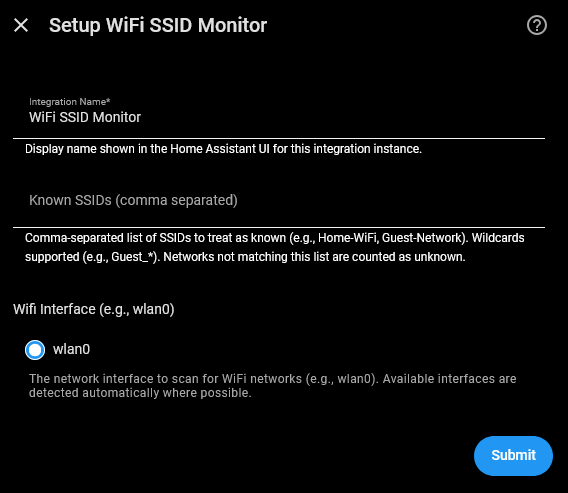

---

</details>

<br>

> [!TIP]
>
> **Finding Your WiFi Interface Name:**
>
> 1. In Home Assistant, go to **Settings > System > Network**.
> 2. Check **Configure network interfaces**.
> 3. Your WiFi interface will typically be listed as `wlan0`, `wlan1`, `wlp2s0`, or similar.

<details>

<summary>
&nbsp; &nbsp; ➕ &nbsp; &nbsp; Click to Expand for Screenshot:
</summary><br>

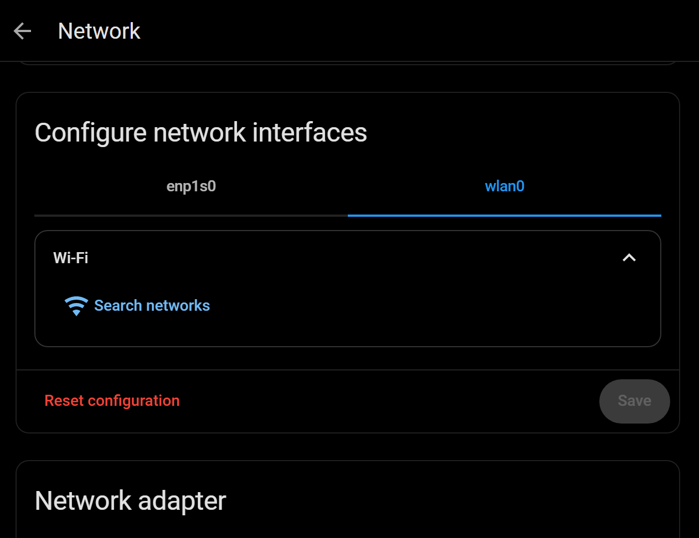

---

</details>

<br>

### 🔨 Runtime Options (Configure / Reconfigure)

After initial setup, settings can be updated by clicking the **Gear icon** ( ⚙ Configure) on the integration card:

<details>

<summary>
&nbsp; &nbsp; ➕ &nbsp; &nbsp; Click to Expand for Details:
</summary><br>

| Parameter | Default | Range | Description |
| :-- | :-- | :-- | :-- |
| **Integration Name** | `WiFi SSID Monitor` | String | Display name shown in the UI for this integration instance. |
| **Known SSIDs** | - | String | Comma-separated list of known networks. Wildcards supported (e.g., `Guest_*`). Case-sensitive. |
| **Always-Unknown SSIDs** | - | String | Comma-separated fnmatch patterns permanently treated as unknown, even if they also match an entry in the known list. Useful for flagging neighbor networks that should never be whitelisted. |
| **WiFi Interface** | `wlan0` | String | Change which WiFi interface is monitored. |
| **Last Seen History TTL** | `90` | 0–366 days | Number of days to retain `last_seen`, `first_seen`, and `visit_counts` history entries. Set to `0` to keep all history indefinitely. |

> [!NOTE]
>
> **Scan Interval, Band Filter, Include Hidden Networks and Proximity Threshold are control entities - not setup or configure fields.** They live on the device page as switches and numbers so they can be changed from a dashboard or an automation without reopening Configure. See [Runtime Controls & Settings](#-runtime-controls--settings-entities) for the full list.

---

> [!TIP]
>
> Changing Name on the Reconfigure screen will change the name of the WiFi SSID Scanner device the integration provides, but will not change the individual sensor entity names. This only happens at set-up, not reconfigure.

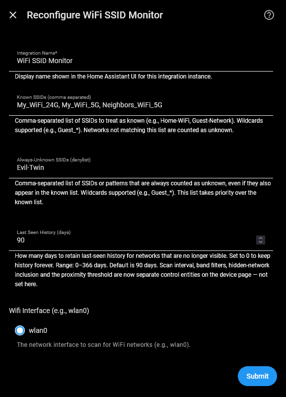

---

</details>

<br>

## 🔩 Under the Hood - Technical Architecture

Details on how this custom component is structured - the Supervisor API and payload normalization, actions and events, self-diagnosis, data polling and resilience, entity identity, and the files it writes.

<details>

<summary>
&nbsp; &nbsp; ➕ &nbsp; &nbsp; Click to Expand for Details:
</summary><br>

### 🎬 Actions & Events (for automations)

Beyond passive entities, the integration exposes an on-demand **action** and a fire-and-forget **event**:

- **Action** (`get_networks`) is a response service - it performs its own fresh read of the current scan and returns data, so it works even when the passive sensors are unavailable, filtered, or capped. See [Actions](#-actions-services).
- **Event** (`wifi_ssid_monitor_new_network`) fires once per newly-seen network. It records the existing set silently on startup or after a history reset (no replay), and is rate-limited so a busy location cannot flood your automations. See [Events](#-events).

### 🩺 Self-diagnosis (Integration Health)

Some failures are **silent** - a scan succeeds but the data is wrong (e.g. a Supervisor update renames a field, or reports signal in a different unit). The **Integration Health** sensor (a `problem` binary sensor, always available even during an outage) watches for these:

- **`on`** when the integration detects a problem with its own data - an unreachable Supervisor, a payload that parsed to nothing, an interface that vanished, a signal-unit change, or every known network disappearing at once.
- **Repair issues** are raised for the few conditions you can act on: **`interface_missing`** (the monitored interface is no longer reported - reconfigure to pick the right one), **`signal_format_changed`** (the Supervisor changed how it reports signal - review the Proximity Threshold), and **`supervisor_unavailable`** (repeated fetch failures).

It's deliberately cautious: it gives startup grace before judging drift, requires a condition to persist over several cycles before flipping, and auto-recovers on the next clean scan. Details - `issues`, `severity`, `degraded_capabilities`, `signal_unit`, `last_good_update` - live in the sensor's attributes; put it on a dashboard or alert on it to catch breakage early instead of months later - see the [Integration Health Problem Alert](#-integration-health-problem-alert) example.

### 🔄 Data Polling & 3-Strike Resilience

The integration utilizes a custom polling mechanism designed to interact with the Home Assistant Supervisor Network API:

- **Supervisor Endpoint**: Polls the endpoint `/network/interface/{interface}/accesspoints` to gather access point configurations.
- **3-Strike Logic**: To prevent entities flickering to `Unavailable` due to temporary network congestion or Supervisor latency, the integration holds its last known values for up to 3 consecutive failures. If the 4th consecutive poll fails, the entities are marked `Unavailable` and an issue is raised in the Home Assistant repairs center.
- **Immediate Refresh**: Updating filter or pattern lists triggers an immediate background scan. You can also trigger an immediate scan at any time by pressing the **Scan Now** button entity or by calling the `wifi_ssid_monitor.scan_now` service. (Changing the scan interval updates the timer without forcing an immediate fetch; Pause Polling halts polling without forcing a fetch.) See the [Security Scan on Arrival](#-security-scan-on-arrival) example.

### 🆔 Stable Entities & Interface Identity

- **Interface-Based Identity**: The integration registers its unique ID based on `wifi_ssid_monitor_{interface}`. This prevents duplicate configurations for the same interface and ensures entity history remains stable.
- **Data Validation & Normalization Boundary**: Values retrieved from the Supervisor API pass through a single parsing boundary (`parse.py`). Signal is normalized to a 0–100% quality scale, frequencies are mapped to channels and 2.4/5/6 GHz bands, and out-of-bounds metrics are safely clamped.

### 💾 Files Written to `config/.storage`

The integration persists three history stores across restarts using `homeassistant.helpers.storage`. All three are written per config entry, so a setup monitoring two interfaces has two sets. Writes are coalesced (not one write per scan) to spare SD cards.

| File | Holds | Classification | Cost of deletion |
| :-- | :-- | :-- | :-- |
| `wifi_ssid_monitor.<entry_id>.last_seen` | When each network was last detected | **Derived cache** | None - repopulates on the next scan |
| `wifi_ssid_monitor.<entry_id>.first_seen` | When each network was first detected | **User history** | Permanent - first-seen dates are lost |
| `wifi_ssid_monitor.<entry_id>.visit_counts` | How many scans each network has appeared in | **User history** | Permanent - appearance counts reset; **New Networks (24h)** re-baselines |

Entries older than the **Last Seen History TTL** (default 90 days) are pruned automatically, and a hard cap of 2,000 entries bounds total growth in a busy location. Set TTL to `0` to retain indefinitely. All three are **deleted automatically** when the integration is removed - see [Removal](#-removal).

> 💡 To clear history deliberately, use the **`wifi_ssid_monitor.clear_last_seen`** action rather than deleting a file by hand - it does the same job cleanly while Home Assistant is running. See the [Weekly History Cleanup](#-weekly-history-cleanup) example. Editing or deleting anything in `.storage` is a bad idea and not recommended.

### 🔄 Dynamic Polling & Standard System Options

- **Both Available**: The integration provides dynamic polling controls, to change the scan interval or trigger an on-demand scan. It also functions normally with the standard Home Assistant **System options** > **Enable polling for changes** toggle.

---

</details>

<br>

## ❓ FAQ & Troubleshooting

> [!TIP]
>
> The entries below cover the problems that come up most often. If you are working through one and not getting to a resolution, remember that "turning it off and on again" is a cliché for a reason.
>
> **Restart Home Assistant, and maybe Reboot the HA system, before declaring failure or seeking help.** Neither is guaranteed to fix your issue, and both are surprisingly effective.

### 🔌 Setup & Connectivity

#### 🚫 **Integration Fails to Load ("Failed to connect to Supervisor API")**

<details>

<summary>
&nbsp; &nbsp; ➕ &nbsp; &nbsp; Click to Expand for Details:
</summary><br>

- **WiFi hardware unavailable**: Verify your Home Assistant system has physical WiFi capabilities enabled under **Settings > System > Network**.
- **Invalid interface**: Ensure the interface name is correct and configured on your host OS. See [Initial Setup](#-initial-setup).
- **Not a HAOS / Supervised install**: The Supervisor Network API is only available on Home Assistant OS or Supervised installations - not on Container or Core.

---

</details>

#### ❔ **No Networks Detected (count reads zero)**

<details>

<summary>
&nbsp; &nbsp; ➕ &nbsp; &nbsp; Click to Expand for Details:
</summary><br>

- Verify the interface name is correct for your system under **Settings > System > Network**.
- Ensure WiFi is enabled and the interface is active.
- Check that networks are actively broadcasting in range of the system.
- Check the **Integration Health** binary sensor - its `issues` attribute names what it detected (e.g. a missing interface). The [Integration Health Problem Alert](#-integration-health-problem-alert) example notifies you automatically.
- Review the Home Assistant logs for detailed error messages.
- Its a computer, turning it off and on again never hurts.

---

</details>

### 📊 Detection, Signals & History

#### ❔ **Fewer Networks Detected Than Expected**

<details>

<summary>
&nbsp; &nbsp; ➕ &nbsp; &nbsp; Click to Expand for Details:
</summary><br>

- The number of WiFi networks this integration can detect depends heavily on the **physical location of your Home Assistant hardware**.
- A system placed centrally in an open area of your home will typically see most networks in range, including expected SSIDs and any rogue signals.
- A system tucked into a metal IT rack, a utility cupboard, or a corner of your home may see significantly fewer networks - metal enclosures and walls attenuate WiFi signals and can reduce scan coverage substantially.

---

</details>

#### 📶 **Proximity Alert Fires Too Often**

<details>

<summary>
&nbsp; &nbsp; ➕ &nbsp; &nbsp; Click to Expand for Details:
</summary><br>

- **Threshold is too permissive**: Increase the **Proximity Signal Threshold** (number entity) toward 90% to require a closer network before the alert fires - signal is a 0–100% quality figure, higher is closer.
- **Persistent unknown networks in range**: call `wifi_ssid_monitor.get_networks` or check the `networks` attribute on **Strongest Unknown SSID** to see which network is triggering it, then decide whether to add it to the Known SSIDs list.

---

</details>

#### 🎯 **Known SSID Pattern Not Matching**

<details>

<summary>
&nbsp; &nbsp; ➕ &nbsp; &nbsp; Click to Expand for Details:
</summary><br>

- **Case mismatch**: Pattern matching is case-sensitive. Verify the pattern casing exactly matches the SSID (e.g., `Guest_*` will not match `guest_wifi`).
- **Missing wildcard**: A plain string is treated as an exact match. Use `Guest_*` or `*guest*` for partial matches.
- **Trailing spaces**: The Known SSIDs field strips leading/trailing whitespace from each entry, but double-check there are no invisible characters.

---

</details>

#### 🕒 **History Contains Stale or Unexpected Entries**

<details>

<summary>
&nbsp; &nbsp; ➕ &nbsp; &nbsp; Click to Expand for Details:
</summary><br>

The `first_seen` / `last_seen` / `visit_count` fields (on **Strongest Unknown SSID** and the `get_networks` response) may hold entries for networks not seen recently, or grow larger than expected.

- **Automatic TTL pruning**: entries older than the **Last Seen History TTL** (default 90 days) are pruned on the next scan. Adjust it in **Configure**, or set `0` to keep all entries indefinitely.
- **Manual reset**: call the `wifi_ssid_monitor.clear_last_seen` action from **Tools > Actions** to clear all three history stores immediately (for the targeted entry, or all entries if `config_entry_id` is omitted).

---

</details>

### 🧰 Troubleshooting Tips

#### 🐛 **How do I download diagnostics?**

<details>

<summary>
&nbsp; &nbsp; ➕ &nbsp; &nbsp; Click to Expand for Details:
</summary><br>

**Settings > Devices & Services > WiFi SSID Monitor > ⋮ (three dots) > Download diagnostics.**

This is the most useful file to attach to a GitHub issue. It captures your options, the current scan data, and the network history in one JSON file.

**It is sanitized before it is written**, so it is safe to share:

- **Your own lists are redacted outright** - the Known SSIDs and Always-Unknown (denylist) values.
- **Everything identifying about nearby networks is pseudonymized**, not blanked. Each SSID becomes `ssid-1`, `ssid-2`… and each BSSID becomes `bssid-1`, `bssid-2`… The same network keeps the same token everywhere it appears - including where an SSID is used as a dictionary key - so the file still reads sensibly.
- **What deliberately stays:** signal quality, channel, band, counts, timestamps, and health flags - the non-identifying substance a maintainer needs.

Nearby-network detections describe **other people's** equipment, which is why the SSID is tokenized and the BSSID redacted.

---

**If setup itself is failing**, there is no config entry yet, so there are no diagnostics to download. In that case capture a log instead - add this to `configuration.yaml` and restart:

```yaml
logger:
  default: warning
  logs:
    custom_components.wifi_ssid_monitor: debug
```

Logs are then visible under **Settings > System > Logs** (click **Load Full Logs**).

> [!IMPORTANT]
>
> **Log files have NO redaction of any kind** - unlike the diagnostics file above, nothing is stripped or pseudonymized. Review a log before pasting it anywhere. In particular, at debug level the raw Supervisor access-point sample (including nearby SSIDs and BSSIDs) can appear in the log.

---

</details>

#### 🔄 **I deleted and re-added the integration - why did my settings and history come back?**

<details>

<summary>
&nbsp; &nbsp; ➕ &nbsp; &nbsp; Click to Expand for Details:
</summary><br>

Because Home Assistant keeps most of it on purpose. This is **Home Assistant behavior, not something this integration controls**, and for most people it's the desirable outcome - re-add the same interface and things carry on where they left off.

| What | How long Home Assistant keeps it | On re-add |
| :-- | :-- | :-- |
| **Long-term statistics** (long-range graphs) | Indefinitely - never deleted | Continue unbroken |
| **Recent detailed history** | Recorder retention (10 days by default) | Continues |
| **Entity IDs** (`sensor.…`) | Reused as long as nothing else took the name | Dashboards & automations keep working |
| Renames, icons, areas, labels, enabled/disabled state | **30 days**, in the entity registry | Restored |
| **Network history** (this integration's `.storage` files) | Not kept - deleted with the integration | Starts fresh |

The **30 days** applies only to that fourth row - the entity-registry customizations. Statistics aren't on a timer at all, and your entity IDs come back either way. So re-adding after a year still reconnects your graphs; you would just need to redo any renames. Restarting Home Assistant in between makes no difference to any of this. Only this integration's own `first_seen` / `visit_count` history is genuinely lost - **New Networks (24h)** rebaselines.

**If you actually wanted a clean slate**, Home Assistant doesn't really offer one - and in practice you rarely need it. Two supported options exist:

- **Tools > Statistics** lists statistics whose entity no longer exists as _"There is no state available for this entity"_, and lets you delete them individually. Supported, immediate, no restart required.
- The **`recorder.purge_entities`** action drops recent history for entities you name. (It does not touch long-term statistics - use the screen above for those.)

Clearing the retained _entity-registry_ customizations is a different matter: it means hand-editing `.storage/core.entity_registry` with Home Assistant stopped. **Don't.** That single file holds the settings for every entity from every integration you run, and the risk of unintended damage far outweighs re-doing a few renames. Nothing about this integration needs it.

> [!TIP]
>
> If you're re-adding to fix a problem rather than to reset data, try **⋮ > Reload** on the integration first. It re-reads everything and re-applies your settings without removing anything.

Also note: an entity ID is reused unless a **different, still-existing** entity has since taken that name, in which case the new one is created as `…_2` and the old statistics stay attached to the original ID. That's uncommon and generally the result of manual renaming elsewhere - it isn't something a normal remove-and-re-add causes.

---

</details>

<br>

## ❗ Known Limitations /❔ What's Missing?

<details>

<summary>
&nbsp; &nbsp; ➕ &nbsp; &nbsp; Click to Expand for Details:
</summary><br>

- **Hidden Networks (No Broadcasted SSID)**: hidden APs are identified individually as `Hidden-<last 4 of BSSID>` where the Supervisor reports a BSSID, so multiple hidden networks in range are counted and tracked separately. Only an AP that reports no BSSID at all falls back to a shared `[hidden]` label. Disable hidden tracking entirely with the **Include Hidden Networks** switch. Note that phones and laptops using randomized MAC addresses can cause hidden entries to churn.
- **Strongest Unknown Signal Returns "unknown" When No Unknown Networks Visible**: `sensor.wifi_ssid_monitor_strongest_unknown_signal` returns `unknown` when nothing unknown is in range - normal and expected, not a fault (a fault shows as `unavailable`). The companion **Strongest Unknown SSID** reads `None Detected` in the same situation, which is the "all clear" state, not an error.
- **Pattern Matching is Case-Sensitive**: Known SSID patterns (including wildcards like `Guest_*`) are matched case-sensitively. `homewifi` and `HomeWiFi` are treated as different networks - make sure your patterns match the exact casing of the SSIDs you want to filter.

---

</details>

<br>

## ❌ Removal

To remove the integration from Home Assistant:

<details>

<summary>
&nbsp; &nbsp; ➕ &nbsp; &nbsp; Click to Expand for Details:
</summary><br>

1. Go to **Settings > Devices & Services**.
2. Find the **WiFi SSID Monitor** card and click into it.
3. Click the **three dots** (⋮) next to the gear icon and select **Delete**.
4. Confirm deletion.

> [!NOTE]
>
> This integration's entities and devices are removed, along with the three [`config/.storage` files](#-files-written-to-configstorage) it created - which means your SSID history is discarded.
>
> Home Assistant keeps your recorded history and entity customizations independently, so re-adding later picks up much where it left off. If that matters to you, see [why settings and history come back](#-i-deleted-and-re-added-the-integration---why-did-my-settings-and-history-come-back).

---

</details>

<br>

To fully uninstall (HACS):

<details>

<summary>
&nbsp; &nbsp; ➕ &nbsp; &nbsp; Click to Expand for Details:
</summary><br>

1. Go to **HACS**.
2. Find the **WiFi SSID Monitor** and click into it.
3. Click the **three dots** (⋮) at the top right and select **Remove**.
4. Restart Home Assistant.

---

</details>

<br>

## 📝 Maintenance Status

This is a **personal project**. Support and updates are provided on a **"best-effort"** basis only. While I use this integration daily and aim to keep it functional with the latest Home Assistant releases, I cannot guarantee immediate fixes for issues or compatibility with all releases.

### 📖 Documentation Accuracy

- This README is updated whenever the integration changes, and is intended to describe the current release accurately.
- Two things can put it out of step: a passage this document missed during a revision, or a Home Assistant screen or setting that has been renamed or moved since it was written.
- If you find either, please [open an issue](https://github.com/PlayFaster/ha-wifi-ssid-monitor/issues). It will be corrected.

## 🤝 Contributors & Acknowledgements

- **Personal prior work**: The structure and integration architecture draw on my own custom components [ZTE Router 5G](https://github.com/PlayFaster/ha-zte-router-5g-monitor) and [Huawei Router 5G](https://github.com/PlayFaster/ha-huawei-router-5g-monitor) Monitors.

- 🤖 This project was developed with the assistance of AI to ensure code quality and adherence to best practices.

## 📄 License

[](https://opensource.org/licenses/Apache-2.0)

This project is licensed under the Apache License, Version 2.0. See [LICENSE](LICENSE) for details.

---

💬 **Questions or Issues?** Visit the [GitHub repository](https://github.com/PlayFaster/ha-wifi-ssid-monitor).
