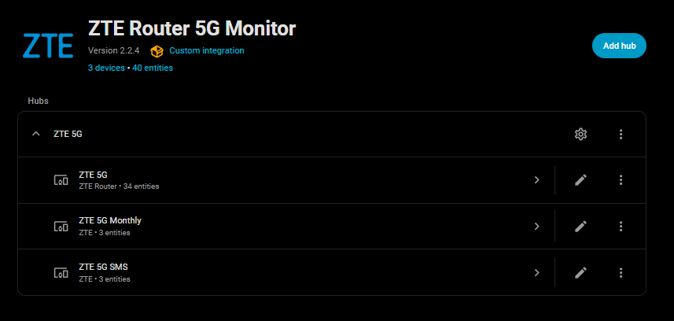
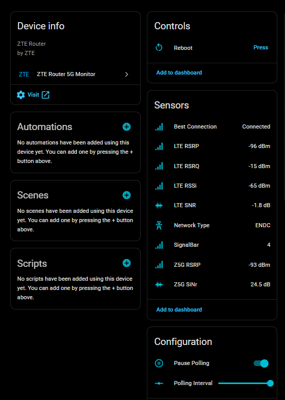
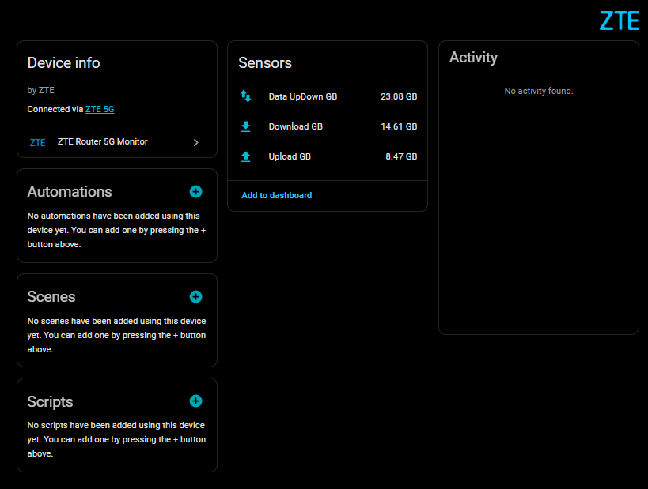
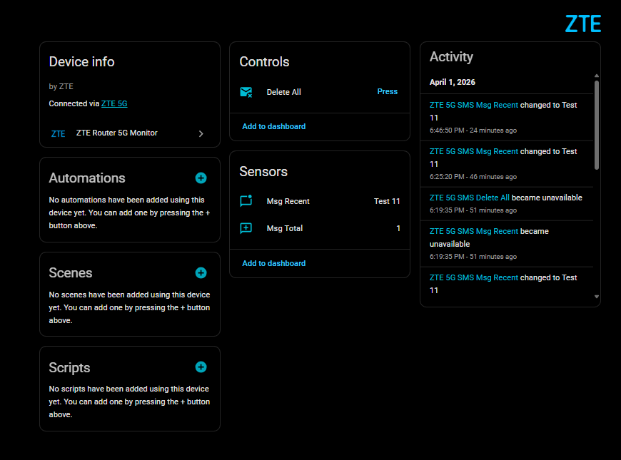

# ZTE Router 5G Monitor for Home Assistant
  
    

Home Assistant integration for ZTE MC7010 5G Router that provides detailed signal statistics, data usage tracking, and SMS management.
  
## Supported Models

- **ZTE MC7010** – 5G Outdoor CPE.
This works with, and has only been tested with, ZTE MC7010. It may work with other similar ZTE devices.
  
## ✅ Features

- **Signal Monitoring**: Real-time RSRP, RSRQ, RSSI, and SNR for both LTE and 5G.
  
- **Data Tracking**: Monthly download, upload, and total usage (GB).
  
- **SMS Management**: View recent messages and delete the mailbox directly from HA.
  
- **Categorized Devices**: Separate devices for Router Stats, Data Usage, and SMS Services.
  
- **Resilient Polling**: Includes a hybrid retry logic (30s retry) and stale-data grace periods to prevent "Unavailable" flickers during router reboots.

- **Pause Polling**: Switch to allow uninterrupted access to the router webui if needed (zte only allow a single login).

## 📸 Screenshots

### Integration Overview

### Signal & Controls

### Data Usage

### SMS Management

## ✨ Installation

### HACS

1. Add this URL as a **Custom Repository** in HACS.
  
2. Click Download.
  
3. Restart Home Assistant and add via the UI.  
  
### Manual

1. Copy the `custom_components/zte_router_5g` folder to your Home Assistant `custom_components` directory.
  
2. Restart Home Assistant.
  
3. Go to **Settings > Devices & Services > Add Integration** and search for "ZTE Router 5G Monitor".
  
## Configuration

Setup is handled entirely via the UI. You will need:

- Router IP Address (e.g., 192.168.0.1)
- Router Username
- Admin Password

## 🛠 Maintenance Status

This is a **personal project**. Support and updates are provided on a **"best-effort"** basis only. While I use this integration daily and aim to keep it functional with the latest Home Assistant releases, I cannot guarantee immediate fixes for issues or compatibility with all router firmware versions.

## Contributors & Acknowledgements

🙏 Special Thanks

- This project is based on the original work done by @Kajkac on ZTE Routers. A big thanks for the heavy lifting!
- This project was developed with the assistance of Gemini AI to ensure code quality and best practices.
  